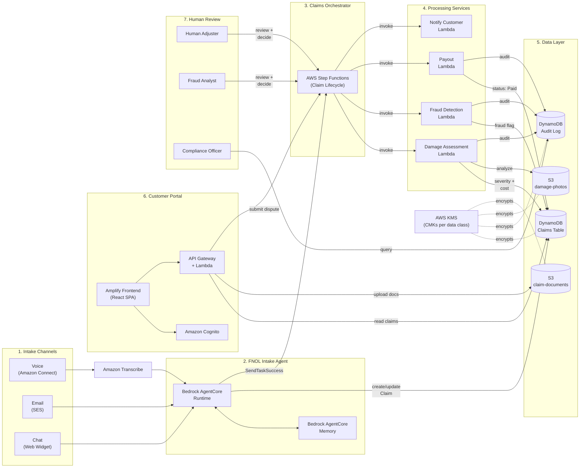
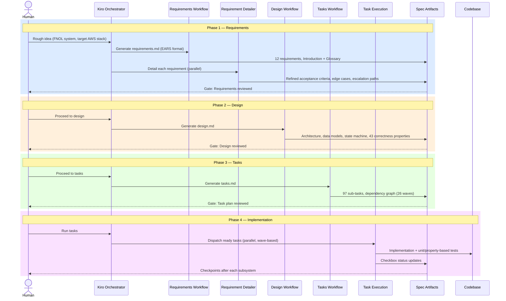

# Claims Management & FNOL System

## 1. What This Project Is

This workspace documents and executes a **greenfield build of a Claims Management and First Notice of Loss (FNOL) system** for a property/casualty insurance use case, developed using **Kiro's spec-driven development workflow** — a structured, AI-agent-assisted process that takes a feature from a rough idea through requirements, design, and implementation tasks, with a human in the loop at every phase gate.

The system lets customers report a claim through voice, email, or chat, with an AI intake agent extracting structured data and preserving conversation context across channels. Uploaded damage photos are analyzed automatically to estimate severity and repair cost, enabling straight-through processing for low-risk claims while routing complex or high-value claims to human adjusters. Claims move through a defined lifecycle — intake, assessment, fraud screening, and payout or dispute — orchestrated as a state machine with retry and escalation handling. Every automated decision is logged, with its inputs and confidence score, to an append-only audit trail before it is allowed to take effect.

**Scope:** 12 requirements · 43 correctness properties · 5 subsystems · 7 backend packages · 108 implementation/test sub-tasks · 1 frontend package (planned)

**Target stack:** Bedrock AgentCore, Amazon Transcribe, Amazon Rekognition, AWS Step Functions, Lambda, DynamoDB, S3, Amplify, Cognito — implemented as TypeScript/Node.js Lambda services in an npm-workspaces monorepo.

---

## 2. Architecture: Five Cooperating Subsystems

### System Context Diagram

The diagram below shows how the three intake channels, the five subsystems, evidence storage, the audit trail, and the human review roles all connect, as defined in the design document.



---

| Subsystem | Package | Responsibility |
|---|---|---|
| **FNOL Intake Agent** | [`backend/services/intake-agent/`](./backend/services/intake-agent/) | Bedrock AgentCore agent — voice/email/chat intake, structured field extraction with confidence scoring, cross-channel session continuity |
| **Damage Assessment Service** | [`backend/services/damage-assessment/`](./backend/services/damage-assessment/) | Amazon Rekognition-based photo analysis — severity rating, estimated repair cost, confidence score |
| **Fraud Detection Service** | [`backend/services/fraud-detection/`](./backend/services/fraud-detection/) | Claim frequency, timeline consistency, and sanctions/watchlist screening; fraud flag aggregation |
| **Claims Orchestrator** | [`backend/services/orchestrator/`](./backend/services/orchestrator/) | AWS Step Functions state machine driving the claim lifecycle (Intake → Assessment → Fraud_Check → Payout/Disputed) with retry/backoff and escalation |
| **Customer Portal** | [`backend/services/portal/`](./backend/services/portal/) | Amplify + Cognito self-service web application — status tracking, document upload, dispute submission; frontend (React SPA) scaffolding planned in tasks.md section 18 |

Two cross-cutting packages support all five: [`backend/services/audit-log/`](./backend/services/audit-log/) (append-only decision audit trail, written *before* any automated decision takes effect) and [`backend/services/shared/`](./backend/services/shared/) (domain types, configuration loader, shared upload validator).

All claim state lives in **DynamoDB**; all binary evidence (photos, documents) lives in **S3**. The [`frontend/`](./frontend/) Amplify web app implements the Customer Portal as a React SPA with login, claims dashboard, claim detail/status timeline, document upload, and dispute submission. Infrastructure is defined as code in [`infra/`](./infra/) using AWS CDK v2.

---

## 3. Spec-Driven Workflow

This project followed Kiro's requirements-first spec workflow: **Requirements → Design → Tasks → Implementation**, with a review checkpoint between each phase.



---

## 4. Project Structure

```
claims-management/
├── .kiro/                          # Kiro spec-driven workflow config
│   └── claims-management-fnol/
│       ├── governance/             # Initial prompt + governance requirements
│       └── specs/                  # Spec config
├── backend/services/               # Backend monorepo (npm workspaces)
│   ├── audit-log/                  # Append-only decision audit trail
│   ├── damage-assessment/          # Rekognition-based photo analysis
│   ├── fraud-detection/            # Fraud screening service
│   ├── intake-agent/               # FNOL Intake Agent (Bedrock AgentCore)
│   ├── orchestrator/               # Claims lifecycle (Step Functions)
│   ├── portal/                     # Customer Portal backend
│   └── shared/                     # Shared domain types + utilities
├── frontend/                       # Customer Portal (Amplify React SPA)
├── infra/                          # AWS CDK v2 Infrastructure as Code
├── tests/integration/              # End-to-end integration tests
├── postman/                        # Postman API collection
├── output/                         # Demo output, screenshots & results
└── spec/                           # Spec-driven workflow artifacts
```

---

## 5. Specs

| Document | Description |
|---|---|
| [`spec/requirements.md`](./spec/requirements.md) | 12 EARS-format requirements covering omnichannel intake, damage assessment, fraud detection, lifecycle orchestration, audit logging, customer portal, dispute resolution, and data protection |
| [`spec/design.md`](./spec/design.md) | Architecture, data models, state machines, key decisions, and 43 correctness properties |
| [`spec/tasks.md`](./spec/tasks.md) | 141 implementation tasks with dependency graph (all complete) |

---

## 6. Code & Tests

| Component | Location | Description |
|---|---|---|
| Backend Services | [`backend/services/`](./backend/services/) | 7 TypeScript/Node.js Lambda packages (audit-log, damage-assessment, fraud-detection, intake-agent, orchestrator, portal, shared) |
| Frontend | [`frontend/`](./frontend/) | Amplify React SPA (login, dashboard, claim detail, document upload, dispute form) |
| Infrastructure | [`infra/`](./infra/) | AWS CDK v2 stack (DynamoDB, S3, Cognito, Lambda, Step Functions, API Gateway, KMS, CloudWatch) |
| Postman Collection | [`postman/Claims-Management-API.postman_collection.json`](./postman/Claims-Management-API.postman_collection.json) | API endpoints + Step Functions test scenarios |
| Integration Tests | [`tests/integration/`](./tests/integration/) | 18 integration test suites validating the deployed stack |

---

## 7. Output & Results

| Document | Description |
|---|---|
| [`output/project-status/project-status.md`](./output/project-status/project-status.md) | Overall project status, task completion, deployment target |
| [`output/session-log/session-log.md`](./output/session-log/session-log.md) | Detailed session log of the spec-driven development process |
| [`output/fnol-intake-agent/fnol-intake-agent-scenarios.md`](./output/fnol-intake-agent/fnol-intake-agent-scenarios.md) | 5 FNOL Intake Agent channel scenarios (Chat, Email, Voice) with end-to-end lifecycle, state machine diagram, and audit log results |
| [`output/channels/channels-testing.md`](./output/channels/channels-testing.md) | Chat and Voice channel end-to-end testing with Amazon Connect integration |
| [`output/frontend-portal/frontend-portal.md`](./output/frontend-portal/frontend-portal.md) | Customer Portal frontend — login, claims dashboard, claim detail, document upload, dispute submission, DynamoDB state, and S3 documents |

---

## 8. Getting Started

```bash
npm install       # install dependencies at the repo root
npm run build     # tsc -b across all backend packages
npm test          # jest, runs against backend/services
npm run lint      # eslint
```