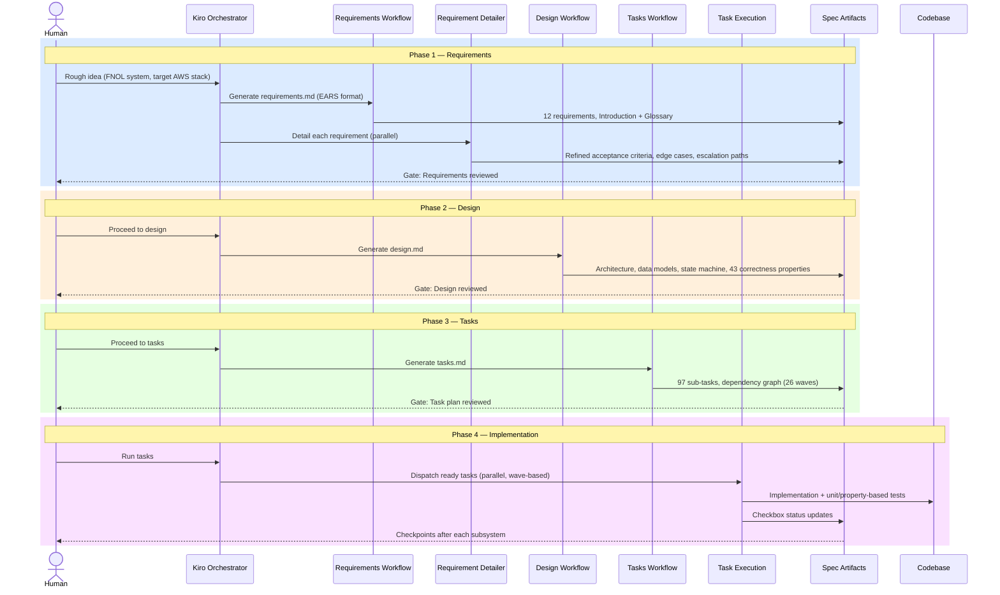

# Claims Management & FNOL System

## 1. What This Project Is

This workspace documents and executes a **greenfield build of a Claims Management and First Notice of Loss (FNOL) system** for a property/casualty insurance use case, developed using **Kiro's spec-driven development workflow** — a structured, AI-agent-assisted process that takes a feature from a rough idea through requirements, design, and implementation tasks, with a human in the loop at every phase gate.

The system lets customers report a claim through voice, email, or chat, with an AI intake agent extracting structured data and preserving conversation context across channels. Uploaded damage photos are analyzed automatically to estimate severity and repair cost, enabling straight-through processing for low-risk claims while routing complex or high-value claims to human adjusters. Claims move through a defined lifecycle — intake, assessment, fraud screening, and payout or dispute — orchestrated as a state machine with retry and escalation handling. Every automated decision is logged, with its inputs and confidence score, to an append-only audit trail before it is allowed to take effect.

**Scope:** 12 requirements · 43 correctness properties · 5 subsystems · 7 backend packages · 97 implementation/test sub-tasks

**Target stack:** Bedrock AgentCore, Amazon Transcribe, Amazon Rekognition, AWS Step Functions, Lambda, DynamoDB, S3, Amplify, Cognito — implemented as TypeScript/Node.js Lambda services in an npm-workspaces monorepo.

---

## 2. Architecture: Five Cooperating Subsystems

| Subsystem | Package | Responsibility |
|---|---|---|
| **FNOL Intake Agent** | [`backend/services/intake-agent/`](./backend/services/intake-agent/) | Bedrock AgentCore agent — voice/email/chat intake, structured field extraction with confidence scoring, cross-channel session continuity |
| **Damage Assessment Service** | [`backend/services/damage-assessment/`](./backend/services/damage-assessment/) | Amazon Rekognition-based photo analysis — severity rating, estimated repair cost, confidence score |
| **Fraud Detection Service** | [`backend/services/fraud-detection/`](./backend/services/fraud-detection/) | Claim frequency, timeline consistency, and sanctions/watchlist screening; fraud flag aggregation |
| **Claims Orchestrator** | [`backend/services/orchestrator/`](./backend/services/orchestrator/) | AWS Step Functions state machine driving the claim lifecycle (Intake → Assessment → Fraud_Check → Payout/Disputed) with retry/backoff and escalation |
| **Customer Portal** | [`backend/services/portal/`](./backend/services/portal/) | Amplify + Cognito self-service web application — status tracking, document upload, dispute submission |

Two cross-cutting packages support all five: [`backend/services/audit-log/`](./backend/services/audit-log/) (append-only decision audit trail, written *before* any automated decision takes effect) and [`backend/services/shared/`](./backend/services/shared/) (domain types, configuration loader, shared upload validator).

All claim state lives in **DynamoDB**; all binary evidence (photos, documents) lives in **S3**. The [`frontend/`](./frontend/) Amplify web app has not been started yet — only the portal's backend API/auth logic exists so far.

---

## 3. Spec-Driven Workflow

This project followed Kiro's requirements-first spec workflow: **Requirements → Design → Tasks → Implementation**, with a review checkpoint between each phase.



---

## 4. Project Status

| Phase | Status |
|---|---|
| 1 — Requirements | ✅ Complete (12 requirements, EARS format, detailed via parallel requirement review) |
| 2 — Design | ✅ Complete (architecture, data models, state machines, 43 correctness properties) |
| 3 — Tasks | ✅ Complete (97 sub-tasks, dependency graph) |
| 4 — Implementation | 🔄 In progress |

**Task plan:** [`spec/tasks.md`](./spec/tasks.md) · **Design:** [`spec/design.md`](./spec/design.md) · **Requirements:** [`spec/requirements.md`](./spec/requirements.md)

**~25% of implementation sub-tasks complete (24 of 97).**

| # | Section | Sub-tasks Done | Status |
|---|---|---|---|
| 1 | Project structure and shared foundations | 4 / 4 | ✅ Done |
| 2 | Audit Log Service | 9 / 9 | ✅ Done |
| 3 | Claims and Claim_Session data access layer | 5 / 5 | ✅ Done |
| — | Checkpoint 4 — all tests pass | — | ✅ Done |
| 5 | Shared evidence upload validation | 2 / 2 | ✅ Done |
| 6 | FNOL Intake Agent — channel normalization and session continuity | 1 / 12 | 🔄 In progress |
| 7 | FNOL Intake Agent — structured field extraction and clarification | 0 / 11 | ⬜ Not started |
| — | Checkpoint 8 — all tests pass | — | ⬜ Not started |
| 9 | Damage Assessment Service | 0 / 7 | ⬜ Not started |
| 10 | Fraud Detection Service | 2 / 10 | 🔄 In progress |
| — | Checkpoint 11 — all tests pass | — | ⬜ Not started |
| 12 | Claims Orchestrator lifecycle and approval logic | 0 / 15 | ⬜ Not started |
| — | Checkpoint 13 — all tests pass | — | ⬜ Not started |
| 14 | Dispute Resolution workflow | 0 / 9 | ⬜ Not started |
| 15 | Customer Portal authentication and session management | 1 / 6 | 🔄 In progress |
| 16 | Customer Portal claim access, document upload, and PII authorization | 0 / 7 | ⬜ Not started |
| — | Checkpoint 17 — final, all tests pass | — | ⬜ Not started |

Build, lint, and the full test suite are passing as of the last verified run (32+ suites, 165+ tests — re-verify with `npm test` for the current count).

---

## 5. Session Log

## ━━━ Phase 1 — Requirements ━━━━━━━━━━━━━━━━━━━━━━━━━━━━━━━━━━

### 📝 Requirements-First Workflow

Generated `requirements.md` from the initial project description (omnichannel intake, damage assessment, fraud screening, lifecycle orchestration, audit logging, customer portal, dispute/appeals) plus a governance-provided draft requirements document. Reconciled gaps between the two: added customer notification on terminal claim status, a dedicated Data Protection and Encryption requirement, and a photo-resubmission step before adjuster escalation.

Each of the 12 requirements was then independently detailed in parallel — tightening EARS wording, adding bounded retry/escalation criteria, and closing edge cases (e.g., ambiguous policy-number matches, rejected field confirmations, dispute reason validation).

**Artifacts:** [`spec/requirements.md`](./spec/requirements.md) · [`.kiro/claims-management-fnol/governance/`](./.kiro/claims-management-fnol/governance/) (initial prompt + governance draft)

---

## ━━━ Phase 2 — Design ━━━━━━━━━━━━━━━━━━━━━━━━━━━━━━━━━━━━━━━━

### 📐 Design Workflow

Produced a full architecture document covering all five subsystems, a system context diagram, key architectural decisions (AgentCore Runtime + Memory for session continuity, Step Functions with `waitForTaskToken` for human-in-the-loop stages, synchronous audit-write-precedes-effect enforcement, DynamoDB conditional writes for immutability), data models aligned to the requirements glossary, and error-handling strategy.

**Key decisions:**
- Mirror `Claim_Session` state into DynamoDB (GSI on policy number + status) since AgentCore Memory alone isn't queryable by policy number
- Model the claim lifecycle as a single Step Functions Standard workflow per claim; disputes get their own short-lived workflow
- Every decision-producing Lambda calls the Audit Log Service synchronously and only proceeds if the write succeeds (Requirement 8.6 fail-safe)

Formalized **43 correctness properties** for property-based testing, each tagged to its validating requirement(s), with infrastructure-only concerns (KMS/TLS wiring, Cognito authorizer presence) explicitly routed to integration/smoke tests instead.

**Artifacts:** [`spec/design.md`](./spec/design.md)

---

## ━━━ Phase 3 — Tasks ━━━━━━━━━━━━━━━━━━━━━━━━━━━━━━━━━━━━━━━━━

### 🗂️ Tasks Workflow

Broke the design into 97 implementation/test sub-tasks across 17 top-level groups (foundations, Audit Log Service, Claims/ClaimSession data layer, shared upload validation, Intake Agent ×2, Damage Assessment, Fraud Detection, Claims Orchestrator, Dispute Resolution, Customer Portal ×2), with 5 checkpoints and all 43 property tests wired in as optional test sub-tasks directly after their implementation task. Generated a 26-wave task dependency graph reflecting cross-package build order.

**Artifacts:** [`spec/tasks.md`](./spec/tasks.md)

---

## ━━━ Phase 4 — Implementation ━━━━━━━━━━━━━━━━━━━━━━━━━━━━━━━━

### ⚙️ Task Execution

**Sections 1–3, 5 — Foundations, Audit Log Service, Claims/ClaimSession data layer, upload validation** ✅ Complete
- Monorepo scaffolding (npm workspaces, TypeScript project references, Jest + fast-check, ESLint)
- Shared domain types/enums and a validated `SystemConfig` loader
- Append-only Audit Log Service: DynamoDB access layer with conditional writes, `recordAutomatedDecision`, the audit-write-precedes-effect wrapper (`Claims.AuditFailure` on any write failure), and a compliance-officer-gated query API
- Claims and ClaimSessions DynamoDB access layers, ULID-based claim ID generation with collision retry, atomic status-history append
- Shared upload validator (format/size) reused by both photo and document uploads
- Checkpoint 4 passed: full build, test, and lint clean

**Section 6 — FNOL Intake Agent (channel/session)** 🔄 In progress
- `ChannelMessage` normalization for Voice/Email/Chat adapters implemented
- Remaining: confidence-based voice confirmation, unparseable-content handling, session lookup/resume logic, and associated property tests

**Section 10 — Fraud Detection Service** 🔄 In progress
- Claim frequency check and a mocked watchlist/sanctions screening client implemented
- Remaining: timeline discrepancy check, fraud flag aggregation, analyst review handler, audit wiring

**Section 15 — Customer Portal authentication** 🔄 In progress
- Cognito authentication integration with a generic, non-leaking invalid-credential message implemented
- Remaining: account lockout tracking, session idle-timeout enforcement, associated property tests

A property-based test flake (fast-check's `fc.date()` generating an occasional Invalid Date, causing `.toISOString()` to throw) was diagnosed and fixed with `noInvalidDate: true` across affected property tests.

**Artifacts:** [`spec/tasks.md`](./spec/tasks.md) (live checkbox tracker) · [`backend/services/`](./backend/services/) (implementation)

---

## 6. Getting Started

```bash
npm install       # install dependencies at the repo root
npm run build     # tsc -b across all backend packages
npm test          # jest, runs against backend/services
npm run lint      # eslint
```

---

## Attribution

This README structure is modeled after [vaishakgh/spec-driven-development](https://github.com/vaishakgh/spec-driven-development/tree/main/brownfield-implementation).
