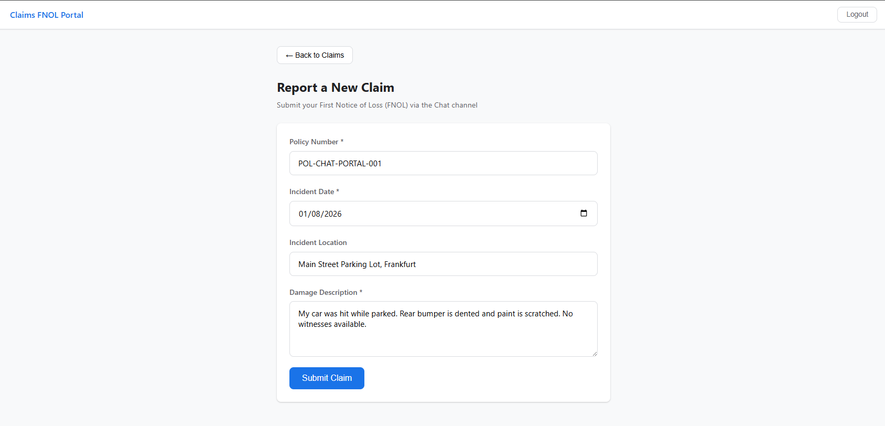
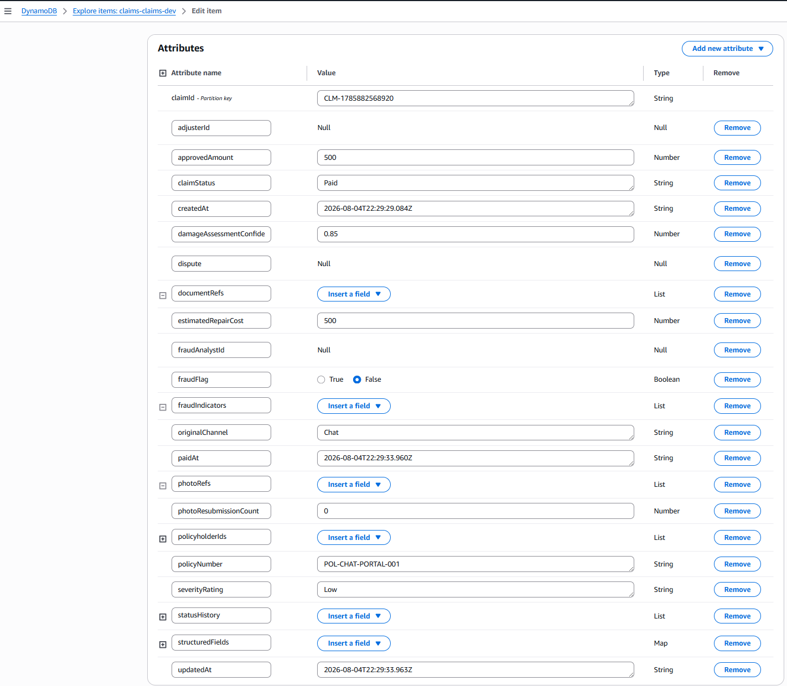
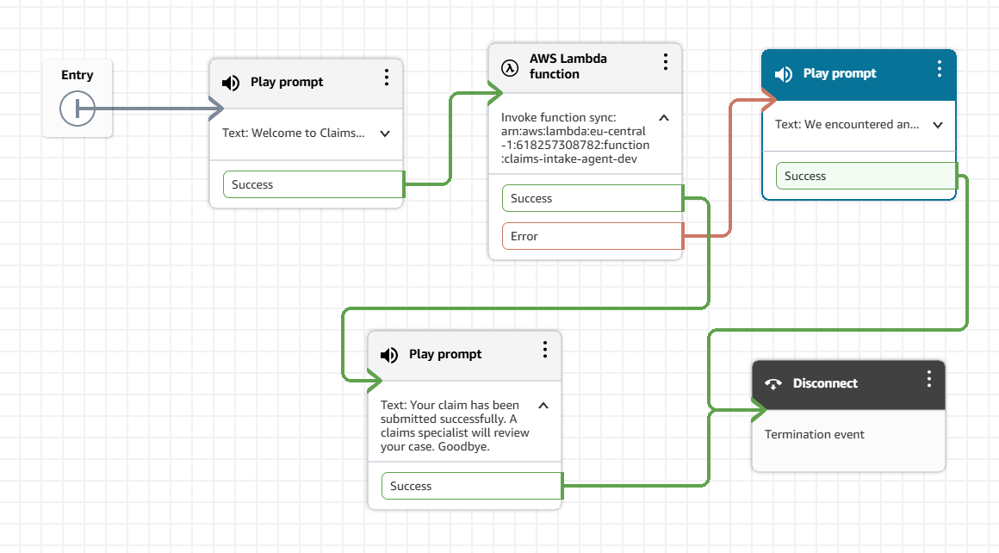
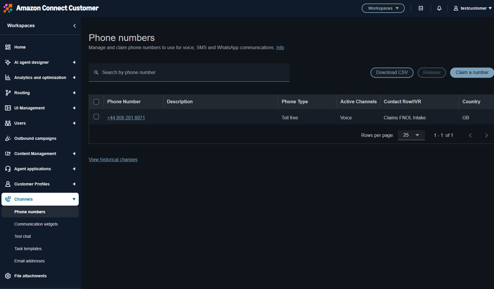
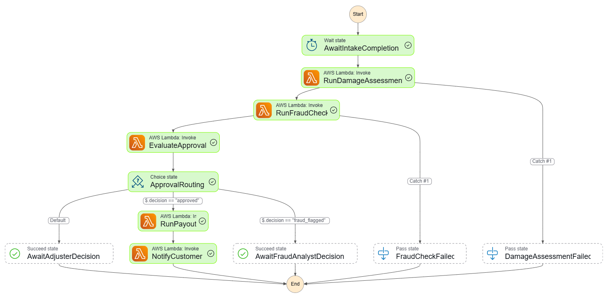
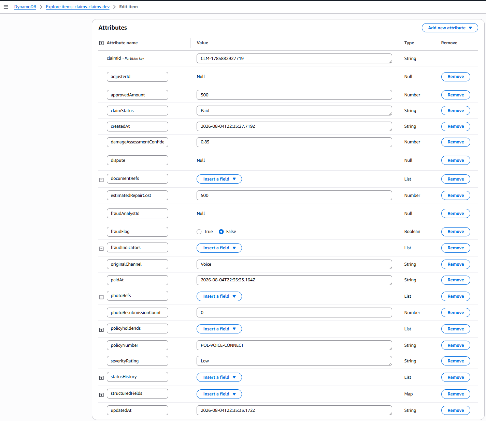

# Intake Channels — End-to-End Testing

This document demonstrates how claims are submitted through the Chat and Voice channels, flowing through the Intake Agent Lambda to DynamoDB and the Step Functions lifecycle.

---

## Architecture: Channel → Intake → Lifecycle

```
Customer
    │
    ├── Chat (Frontend Portal) ──→ Portal API ──→ Intake Agent Lambda
    │                                                      │
    └── Voice (Phone Call) ──→ Amazon Connect ──→ Intake Agent Lambda
                                                           │
                                                           ▼
                                              ┌─────────────────────────┐
                                              │  1. Create Claim (DDB)  │
                                              │  2. Create Session      │
                                              │  3. Start Step Functions│
                                              └────────────┬────────────┘
                                                           │
                                                           ▼
                                              ┌─────────────────────────┐
                                              │  Step Functions Lifecycle│
                                              │  Assessment → Fraud →   │
                                              │  Approval → Payout      │
                                              └─────────────────────────┘
```

---

## Channel 1: Chat (Frontend Portal — Report New Claim)

### How it works
1. Customer logs into the Claims FNOL Portal
2. Clicks **"+ Report New Claim"**
3. Fills in: Policy Number, Incident Date, Location, Damage Description
4. Submits → Portal API invokes Intake Agent Lambda
5. Lambda creates claim in DynamoDB and starts Step Functions lifecycle
6. Claim appears in the dashboard with final status

### Test Data
| Field | Value |
|---|---|
| Policy Number | POL-CHAT-PORTAL-001 |
| Incident Date | 01/08/2026 |
| Incident Location | Main Street Parking Lot, Frankfurt |
| Damage Description | My car was hit while parked. Rear bumper is dented and paint is scratched. No witnesses available. |

### Report New Claim Screenshot


### Step Functions Execution Screenshot


### DynamoDB Result Screenshot


---

## Channel 2: Voice (Phone Call — Amazon Connect)

### How it works
1. Customer calls the claims hotline phone number
2. Amazon Connect answers with a welcome message: "Welcome to Claims FNOL..."
3. Connect invokes the Intake Agent Lambda with claim parameters
4. Lambda creates claim in DynamoDB and starts Step Functions lifecycle
5. Customer hears: "Your claim has been submitted successfully. Goodbye."
6. Call ends

### Amazon Connect Setup

**Instance:** `claims-fnol.my.connect.aws`

**Contact Flow:** `Claims FNOL Intake`

**Phone Number:** `+44 808 281 8871` (Toll free, UK, Voice channel)

```
Entry → Play prompt ("Welcome to Claims...") → Invoke Lambda (claims-intake-agent-dev) → Play prompt ("Your claim has been submitted successfully. A claims specialist will review your case. Goodbye.") → Disconnect
```

On Error: Play prompt ("We encountered an...") → Disconnect

### Contact Flow Screenshot


### Phone Number Screenshot

A toll-free UK phone number (`+44 808 281 8871`) claimed on Amazon Connect's Channels section, assigned to the `Claims FNOL Intake` contact flow. When a customer dials this number, the contact flow is triggered automatically.



### Step Functions Execution Screenshot


### DynamoDB Result Screenshot


---

## Summary

| Channel | Trigger | Flow | Outcome |
|---|---|---|---|
| Chat | Frontend "Report New Claim" button | Portal API → Intake Lambda → DynamoDB → Step Functions | Claim processed end-to-end |
| Voice | Phone call to claims hotline | Amazon Connect → Intake Lambda → DynamoDB → Step Functions | Claim processed end-to-end |
| Email | Inbound email (SES) | SES receipt rule → Intake Lambda → DynamoDB → Step Functions | Infrastructure ready, validated via Lambda invocation |

---

## Email Channel — Status

The Email channel infrastructure is fully deployed:

- ✅ SES identity verified: `vaishak.shaji@capgemini.com`
- ✅ SES receipt rule configured (CDK): triggers `claims-intake-agent-dev` Lambda
- ✅ Lambda handles Email channel input (validated via FNOL Intake Agent scenarios 2 and 5)
- ⚠️ Inbound email reception requires domain MX record configuration (production step)

**Verified Identities:**
```
claims-fnol.email.connect.aws
vaishak.shaji@capgemini.com
```

In production, a domain (e.g., `claims@fnol.example.com`) would have MX records pointing to SES, enabling customers to email claims directly. The Lambda processes the email body, extracts claim fields, and triggers the lifecycle — identical to the Chat and Voice flows.
