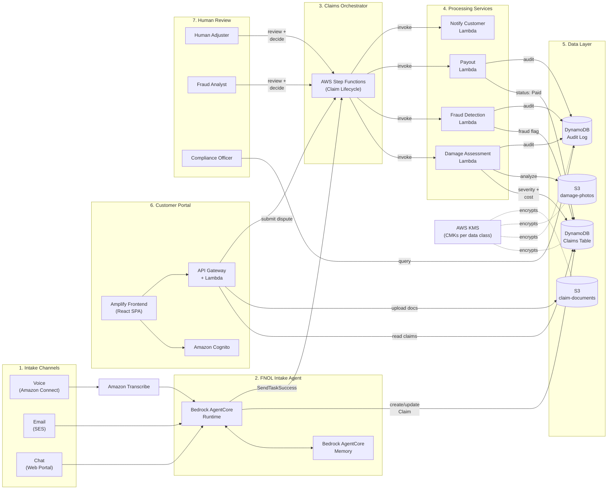

# Claims Management & FNOL System — Testing Report

---

## 1. Introduction

The Claims Management and First Notice of Loss (FNOL) system enables insurance customers to report claims through voice, email, or chat, and automates the intake, assessment, fraud screening, and payout lifecycle of those claims.

An AI intake agent extracts structured claim data from unstructured customer communications and preserves conversation context across channels. Uploaded damage photos are analyzed automatically to estimate severity and repair cost, enabling straight-through processing for low-risk claims while routing complex or high-value claims to human adjusters.

A continuous fraud detection capability screens claims for suspicious patterns and holds automated payouts pending analyst review when indicators are present. Claims progress through a defined lifecycle orchestrated as a state machine with retry and escalation handling, and every automated decision is logged with its inputs and confidence score to satisfy regulatory audit requirements.

Customers can track claim status, upload additional documents, and contest decisions through a secure self-service portal.

### Target Stack

Bedrock AgentCore, Amazon Transcribe, Amazon Rekognition, AWS Step Functions, Lambda, DynamoDB, S3, Amplify, Cognito — implemented as TypeScript/Node.js Lambda services in an npm-workspaces monorepo.

### Deployment

| Setting | Value |
|---|---|
| AWS Account | 618257308782 |
| Region | eu-central-1 |
| Stage | dev |
| Stack Name | claims-dev |
| Portal URL | http://claims-portal-frontend-618257308782.s3-website.eu-central-1.amazonaws.com |
| API URL | https://jhodnkuoj6.execute-api.eu-central-1.amazonaws.com/dev/ |
| Connect Instance | claims-fnol.my.connect.aws |

---

## 2. Solution Architecture

The system comprises five cooperating subsystems connected through AWS Step Functions orchestration, with DynamoDB for all claim state and S3 for binary evidence.

### System Context Diagram

> **Note:** The diagram below uses Mermaid syntax. To render it for DOCX/PDF, go to https://mermaid.live, paste the code, and download as PNG/SVG at large size.



**To generate the diagram image:**
1. Copy the Mermaid code above (between the triple backticks)
2. Go to https://mermaid.live
3. Paste the code
4. Download as PNG or SVG (select large size for clarity in DOCX/PDF)
5. Insert the exported image into your document

### Subsystems

| Subsystem | AWS Services | Responsibility |
|---|---|---|
| FNOL Intake Agent | Lambda, Bedrock AgentCore | Voice/email/chat intake, field extraction, session continuity |
| Damage Assessment | Lambda, Amazon Rekognition | Photo analysis, severity rating, repair cost estimation |
| Fraud Detection | Lambda | Claim frequency, timeline consistency, watchlist screening |
| Claims Orchestrator | Step Functions, Lambda | Lifecycle state machine, retry/backoff, escalation |
| Customer Portal | API Gateway, Cognito, S3 | Status tracking, document upload, dispute submission |

---

## 3. Channel Testing — Chat & Voice

### 3.1 Chat Channel (Frontend Portal — Report New Claim)

**How it works:**
1. Customer logs into the Claims FNOL Portal
2. Clicks "Report New Claim"
3. Fills in: Policy Number, Incident Date, Location, Damage Description
4. Submits → Portal API invokes Intake Agent Lambda
5. Lambda creates claim in DynamoDB and starts Step Functions lifecycle
6. Claim appears in the dashboard with final status

**Test Data:**

| Field | Value |
|---|---|
| Policy Number | POL-CHAT-PORTAL-001 |
| Incident Date | 01/08/2026 |
| Incident Location | Main Street Parking Lot, Frankfurt |
| Damage Description | My car was hit while parked. Rear bumper is dented and paint is scratched. No witnesses available. |

**Report New Claim Screenshot:**


**Step Functions Execution:**


**DynamoDB Result:**


---

### 3.2 Voice Channel (Phone Call — Amazon Connect)

**How it works:**
1. Customer calls the claims hotline phone number
2. Amazon Connect answers with a welcome message
3. Connect invokes the Intake Agent Lambda with claim parameters
4. Lambda creates claim in DynamoDB and starts Step Functions lifecycle
5. Customer hears: "Your claim has been submitted successfully. A claims specialist will review your case. Goodbye."
6. Call ends

**Amazon Connect Setup:**
- Instance: `claims-fnol.my.connect.aws`
- Contact Flow: `Claims FNOL Intake`
- Phone Number: `+44 808 281 8871` (Toll free, UK, Voice channel)

**Contact Flow:**


**Phone Number (Toll-free, claimed on Amazon Connect Channels):**


**Step Functions Execution:**


**DynamoDB Result:**


---

## 4. Customer Portal Testing

### 4.1 Login Screen

The login screen authenticates customers via Amazon Cognito (USER_PASSWORD_AUTH flow). It displays a generic "Invalid username or password" message on any authentication failure — never revealing whether the username or password was incorrect.


---

### 4.2 Claims Dashboard

After login, the customer sees all their claims in a card grid layout with color-coded status badges.

- Green: Paid, Approved
- Red: Denied
- Amber: Disputed
- Blue: Pending_Adjuster_Review


---

### 4.3 Claim Detail View

Clicking a claim card opens the detail view showing claim summary, status history timeline, document upload, and dispute form.


---

### 4.4 Document Upload

Customers upload supporting documents (PDF, JPEG, PNG). Client-side validation rejects unsupported formats and oversized files. Files are uploaded directly to S3 via pre-signed URLs.


---

### 4.5 Dispute Submission

Customers can dispute decisions (Approved or Denied). The form validates reason length (max 2000 characters) and updates the claim status to "Disputed" in DynamoDB.


---

### 4.6 DynamoDB — Claim State After Portal Actions

After uploading documents and submitting a dispute, the claim state in DynamoDB shows the full audit trail including document references and dispute details.


---

### 4.7 S3 — Uploaded Documents

Documents uploaded through the portal are stored in S3, organized by claim ID with timestamp-prefixed filenames.


---

## 5. FNOL Intake Agent — Scenario Testing

### Decision Thresholds

| Parameter | Value | Effect |
|---|---|---|
| fraudFrequencyThreshold | 3 | > 3 claims in window → fraud flag |
| autoApprovalThreshold.maxSeverityRating | Low | > Low → route to adjuster |
| autoApprovalThreshold.maxEstimatedRepairCost | $2,000 | > $2,000 → route to adjuster |
| Timeline check | incidentDate > claimCreatedDate | → fraud flag (logical impossibility) |

---

### 5.1 Scenario: Chat Channel — Normal Claim (Auto-Approved)

**Input:**
```json
{
  "channel": "Chat",
  "claimId": "CLM-CHAT-001",
  "policyNumber": "POL-CHAT-100",
  "priorClaimCount": 1
}
```

**Expected Flow:**
```
Chat → Intake Agent → DynamoDB (Intake) → Step Functions → Assessment → Fraud Check → Approved → Paid
```

**Decision:** No fraud (1 ≤ 3), Low severity, $500 cost (≤ $2000) → Auto-approved

**Result:** ✅ Paid $500


---

### 5.2 Scenario: Email Channel — Normal Claim (Auto-Approved)

**Input:**
```json
{
  "channel": "Email",
  "claimId": "CLM-EMAIL-001",
  "policyNumber": "POL-EMAIL-200",
  "priorClaimCount": 2
}
```

**Decision:** No fraud (2 ≤ 3), Low severity, $500 cost → Auto-approved

**Result:** ✅ Paid $500


---

### 5.3 Scenario: Voice Channel — Fraud Detected (High Frequency)

**Input:**
```json
{
  "channel": "Voice",
  "claimId": "CLM-VOICE-001",
  "policyNumber": "POL-VOICE-300",
  "priorClaimCount": 5
}
```

**Decision:** 5 prior claims > threshold of 3 → **FRAUD DETECTED** (ClaimFrequency, confidence: 0.67)

**Result:** 🚨 Fraud flagged — suspended pending analyst review


---

### 5.4 Scenario: Chat Channel — High Cost (Routed to Adjuster)

**Input:**
```json
{
  "channel": "Chat",
  "claimId": "CLM-CHAT-HIGHCOST",
  "policyNumber": "POL-CHAT-400",
  "priorClaimCount": 1,
  "estimatedRepairCost": 5000
}
```

**Decision:** No fraud, but severity=High and cost=$5000 > $2000 threshold → **EXCEEDS THRESHOLD**

**Result:** ⏸️ Routed to adjuster — cost and severity exceed auto-approval limits


---

### 5.5 Scenario: Email Channel — Timeline Discrepancy (Fraud Flagged)

**Input:**
```json
{
  "channel": "Email",
  "claimId": "CLM-EMAIL-TIMELINE",
  "policyNumber": "POL-EMAIL-500",
  "incidentDate": "2026-08-15T00:00:00Z",
  "claimCreatedDate": "2026-07-28T00:00:00Z"
}
```

**Decision:** Incident date (Aug 15) is AFTER claim creation date (Jul 28) → **TIMELINE DISCREPANCY** (confidence: 0.9)

**Why this is suspicious:** The customer is reporting damage that supposedly hasn't happened yet — a strong indicator of fraudulent intent.

**Result:** 🚨 Fraud flagged — timeline inconsistency detected


---

## 6. Summary of Results

| # | Scenario | Channel | Trigger | Outcome |
|---|---|---|---|---|
| 1 | Chat Normal | Chat | Low risk | ✅ Paid $500 |
| 2 | Email Normal | Email | Low risk | ✅ Paid $500 |
| 3 | Voice Fraud | Voice | 5 prior claims | 🚨 Fraud flagged |
| 4 | Chat High Cost | Chat | $5000 repair | ⏸️ Adjuster review |
| 5 | Email Timeline | Email | Future incident date | 🚨 Fraud flagged |
| 6 | Chat Portal | Chat (Frontend) | Report New Claim form | ✅ Paid $500 |
| 7 | Voice Connect | Voice (Phone) | +44 808 281 8871 call | ✅ Paid $500 |
| 8 | Document Upload | Portal | Upload JPEG/PDF | ✅ Stored in S3 |
| 9 | Dispute | Portal | Submit dispute reason | ✅ Status → Disputed |

### Audit Log

Every automated decision is recorded in the `claims-audit-log-dev` DynamoDB table before it takes effect:

| Scenario | decisionType | confidenceScore |
|---|---|---|
| Normal → Approved | Approval | 0.95 |
| Normal → Paid | Payout | 1.0 |
| Fraud → Pending | Approval | 0.5 |
| High Cost → Pending | Approval | 0.95 |
| Timeline → Pending | Approval | 0.5 |
