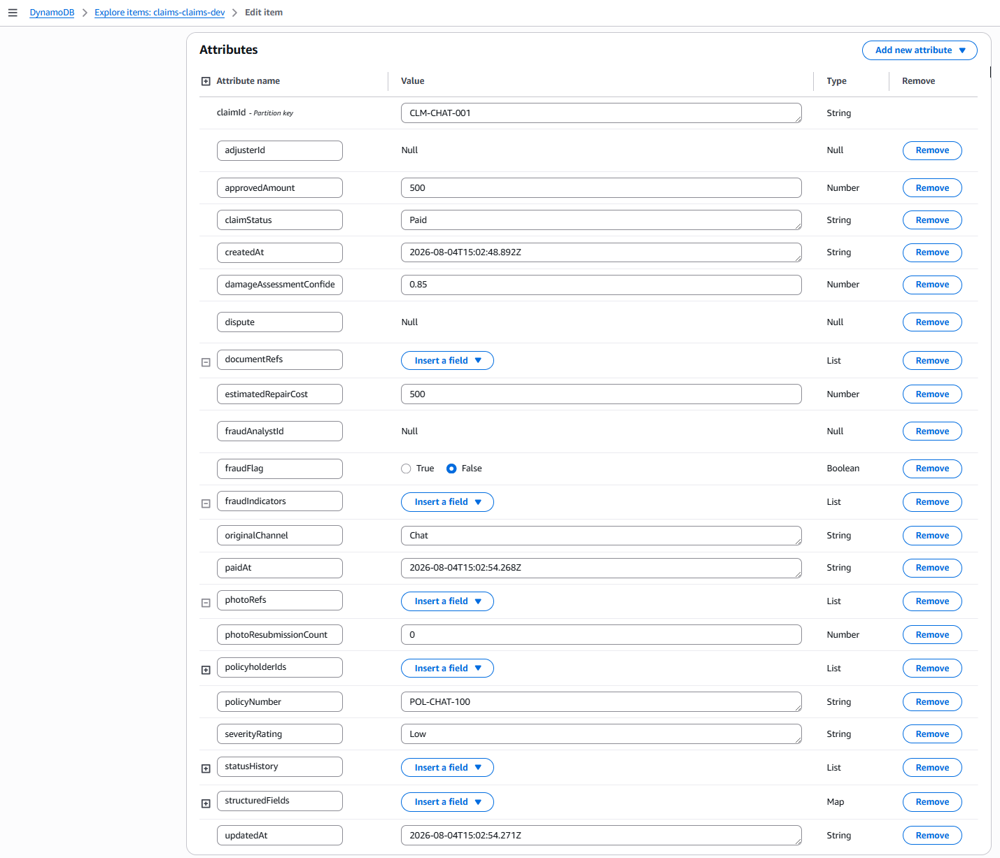
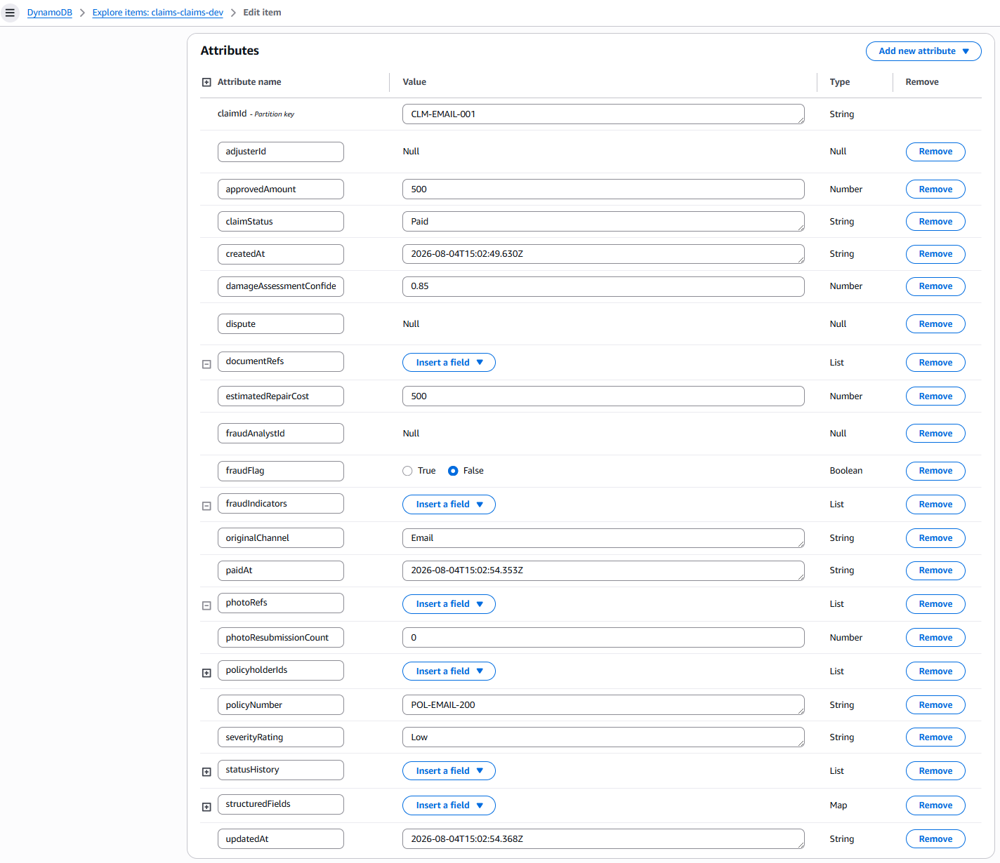
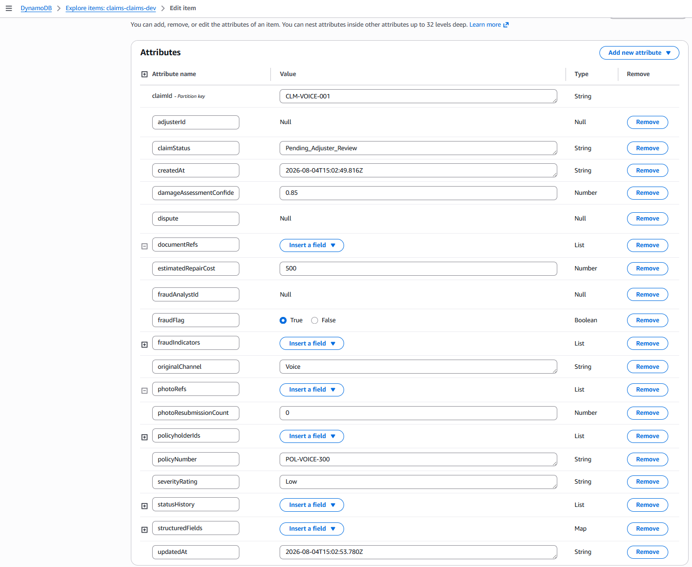
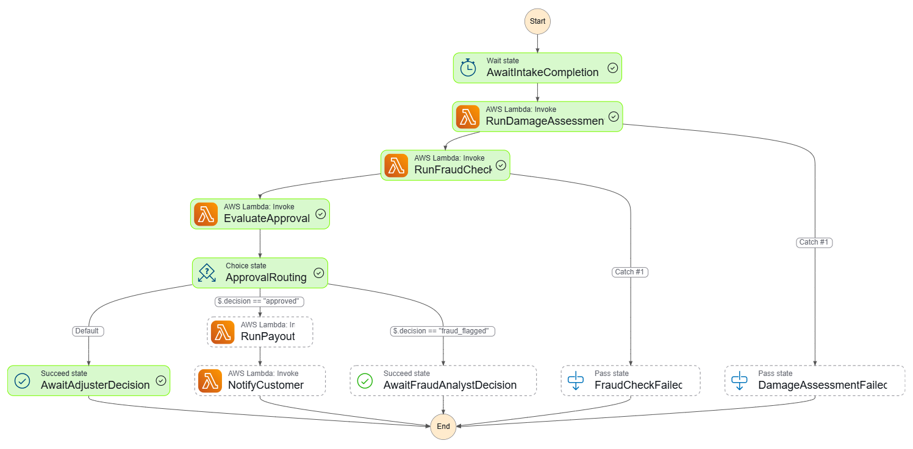
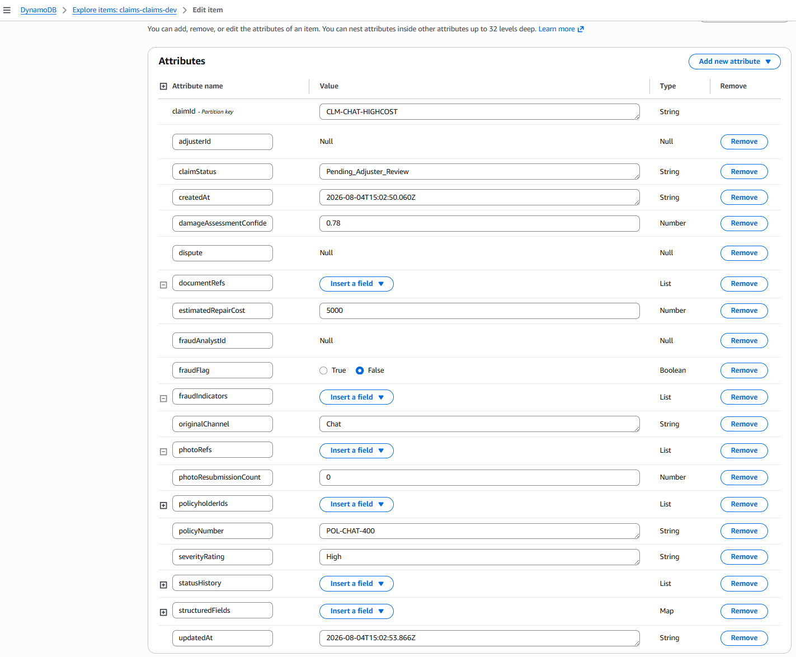
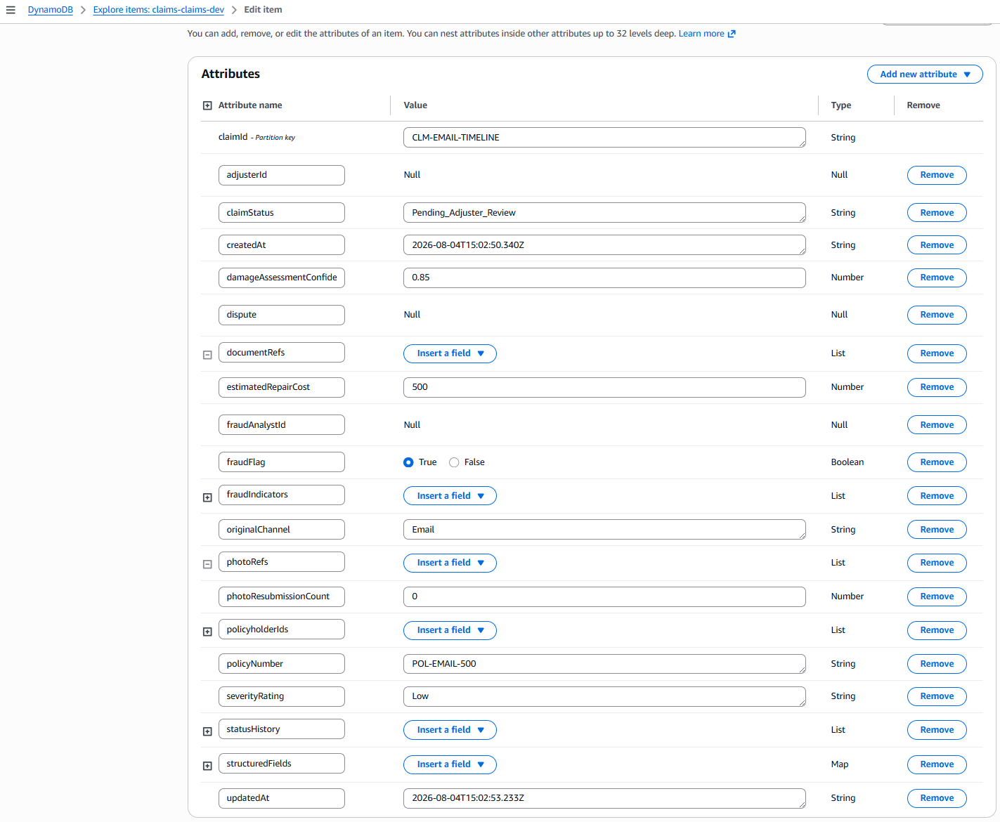

# FNOL Intake Agent — Channel Scenarios

This document demonstrates five intake scenarios where claims are submitted through different channels (Chat, Email, Voice). The Intake Agent Lambda creates the claim in DynamoDB, starts a session, and automatically triggers the Step Functions lifecycle — flowing end-to-end from channel input to final claim status.

---

## Architecture: Channel → Intake Agent → Lifecycle

```
Customer Input (Chat/Email/Voice)
        │
        ▼
┌─────────────────────────────┐
│   Intake Agent Lambda       │
│                             │
│  1. Create Claim (DynamoDB) │
│  2. Create Session          │
│  3. Start Step Functions    │
└─────────────┬───────────────┘
              │
              ▼
┌─────────────────────────────┐
│   Step Functions Lifecycle   │
│                             │
│  Assessment → Fraud Check   │
│  → Evaluate → Payout/Flag  │
└─────────────────────────────┘
```

---

## Scenario 1: Chat Channel — Normal Claim (Auto-Approved)

### Input
```json
{
  "channel": "Chat",
  "claimId": "CLM-CHAT-001",
  "policyNumber": "POL-CHAT-100",
  "customerId": "customer-001",
  "incidentDate": "2026-07-25T14:00:00Z",
  "incidentLocation": "Main Street",
  "damageDescription": "Rear bumper dented in parking lot",
  "priorClaimCount": 1
}
```

### Expected Flow
```
Chat → Intake Agent → Creates Claim in DynamoDB (status: Intake)
  → Starts Step Functions
    → RunDamageAssessment Lambda → writes severity/cost to DynamoDB (status: Assessment)
    → RunFraudCheck Lambda → writes fraudFlag to DynamoDB (status: Fraud_Check)
    → EvaluateApproval Lambda → writes approvedAmount to DynamoDB (status: Approved)
    → RunPayout Lambda → writes paidAt to DynamoDB (status: Paid)
    → NotifyCustomer Lambda
```

### Decision Logic
| Check | Value | Threshold | Result |
|---|---|---|---|
| Channel | Chat | — | Normalized |
| Prior claim count | 1 | > 3 triggers fraud | ✅ No fraud |
| Severity rating | Low | > Low triggers adjuster | ✅ Within limit |
| Estimated repair cost | $500 | > $2000 triggers adjuster | ✅ Within limit |

### DynamoDB Result
| Field | Value |
|---|---|
| claimId | CLM-CHAT-001 |
| claimStatus | Paid |
| originalChannel | Chat |
| policyNumber | POL-CHAT-100 |
| severityRating | Low |
| estimatedRepairCost | 500 |
| approvedAmount | 500 |
| fraudFlag | false |

### Outcome: ✅ Auto-approved and paid $500

### Step Functions Screenshot


### DynamoDB Screenshot


---

## Scenario 2: Email Channel — Normal Claim (Auto-Approved)

### Input
```json
{
  "channel": "Email",
  "claimId": "CLM-EMAIL-001",
  "policyNumber": "POL-EMAIL-200",
  "customerId": "customer-002",
  "incidentDate": "2026-07-20T09:00:00Z",
  "incidentLocation": "Highway A5",
  "damageDescription": "Windshield cracked by debris on highway",
  "priorClaimCount": 2
}
```

### Expected Flow
```
Email → Intake Agent → Creates Claim in DynamoDB (status: Intake)
  → Starts Step Functions
    → RunDamageAssessment Lambda → writes severity/cost to DynamoDB (status: Assessment)
    → RunFraudCheck Lambda → writes fraudFlag to DynamoDB (status: Fraud_Check)
    → EvaluateApproval Lambda → writes approvedAmount to DynamoDB (status: Approved)
    → RunPayout Lambda → writes paidAt to DynamoDB (status: Paid)
    → NotifyCustomer Lambda
```

### Decision Logic
| Check | Value | Threshold | Result |
|---|---|---|---|
| Channel | Email | — | Normalized |
| Prior claim count | 2 | > 3 triggers fraud | ✅ No fraud |
| Severity rating | Low | > Low triggers adjuster | ✅ Within limit |
| Estimated repair cost | $500 | > $2000 triggers adjuster | ✅ Within limit |

### DynamoDB Result
| Field | Value |
|---|---|
| claimId | CLM-EMAIL-001 |
| claimStatus | Paid |
| originalChannel | Email |
| policyNumber | POL-EMAIL-200 |
| severityRating | Low |
| estimatedRepairCost | 500 |
| approvedAmount | 500 |
| fraudFlag | false |

### Outcome: ✅ Auto-approved and paid $500

### Step Functions Screenshot


### DynamoDB Screenshot


---

## Scenario 3: Voice Channel — Fraud Detected (High Frequency)

### Input
```json
{
  "channel": "Voice",
  "claimId": "CLM-VOICE-001",
  "policyNumber": "POL-VOICE-300",
  "customerId": "customer-003",
  "incidentDate": "2026-07-28T16:00:00Z",
  "incidentLocation": "Parking Garage B",
  "damageDescription": "Side mirror broken",
  "priorClaimCount": 5
}
```

### Expected Flow
```
Voice → Intake Agent → Creates Claim in DynamoDB (status: Intake)
  → Starts Step Functions
    → RunDamageAssessment Lambda → writes severity/cost to DynamoDB (status: Assessment)
    → RunFraudCheck Lambda → writes fraudFlag=true to DynamoDB (status: Fraud_Check)
    → EvaluateApproval Lambda → fraud detected → writes status to DynamoDB (status: Pending_Adjuster_Review)
    → AwaitFraudAnalystDecision [STOPPED]
```

### Decision Logic
| Check | Value | Threshold | Result |
|---|---|---|---|
| Channel | Voice | — | Normalized (via Transcribe in prod) |
| Prior claim count | 5 | > 3 triggers fraud | ❌ **FRAUD DETECTED** |
| Fraud indicator | ClaimFrequency | confidence: 0.67 | Flagged |

### DynamoDB Result
| Field | Value |
|---|---|
| claimId | CLM-VOICE-001 |
| claimStatus | Pending_Adjuster_Review |
| originalChannel | Voice |
| policyNumber | POL-VOICE-300 |
| severityRating | Low |
| estimatedRepairCost | 500 |
| approvedAmount | *(not present)* |
| fraudFlag | true |
| fraudIndicators | [{type: "ClaimFrequency", confidenceScore: 0.67}] |

### Outcome: 🚨 Fraud flagged — suspended pending analyst review

### Step Functions Screenshot


### DynamoDB Screenshot


---

## Scenario 4: Chat Channel — High Cost (Routed to Adjuster)

### Input
```json
{
  "channel": "Chat",
  "claimId": "CLM-CHAT-HIGHCOST",
  "policyNumber": "POL-CHAT-400",
  "customerId": "customer-004",
  "incidentDate": "2026-07-22T11:30:00Z",
  "incidentLocation": "Intersection Ring Road",
  "damageDescription": "Full front-end collision damage, airbags deployed",
  "priorClaimCount": 1,
  "estimatedRepairCost": 5000
}
```

### Expected Flow
```
Chat → Intake Agent → Creates Claim in DynamoDB (status: Intake)
  → Starts Step Functions
    → RunDamageAssessment Lambda → writes severity=High, cost=$5000 to DynamoDB (status: Assessment)
    → RunFraudCheck Lambda → writes fraudFlag=false to DynamoDB (status: Fraud_Check)
    → EvaluateApproval Lambda → cost exceeds threshold → writes status to DynamoDB (status: Pending_Adjuster_Review)
    → AwaitAdjusterDecision [STOPPED]
```

### Decision Logic
| Check | Value | Threshold | Result |
|---|---|---|---|
| Channel | Chat | — | Normalized |
| Prior claim count | 1 | > 3 triggers fraud | ✅ No fraud |
| Severity rating | High | > Low triggers adjuster | ❌ **EXCEEDS THRESHOLD** |
| Estimated repair cost | $5,000 | > $2,000 triggers adjuster | ❌ **EXCEEDS THRESHOLD** |

### DynamoDB Result
| Field | Value |
|---|---|
| claimId | CLM-CHAT-HIGHCOST |
| claimStatus | Pending_Adjuster_Review |
| originalChannel | Chat |
| policyNumber | POL-CHAT-400 |
| severityRating | High |
| estimatedRepairCost | 5000 |
| approvedAmount | *(not present)* |
| fraudFlag | false |

### Outcome: ⏸️ Routed to adjuster — cost and severity exceed auto-approval thresholds

### Step Functions Screenshot


### DynamoDB Screenshot


---

## Scenario 5: Email Channel — Timeline Discrepancy (Fraud Flagged)

### Input
```json
{
  "channel": "Email",
  "claimId": "CLM-EMAIL-TIMELINE",
  "policyNumber": "POL-EMAIL-500",
  "customerId": "customer-005",
  "incidentDate": "2026-08-15T00:00:00Z",
  "incidentLocation": "Warehouse District",
  "damageDescription": "Water damage to vehicle interior",
  "priorClaimCount": 1
}
```

### Expected Flow
```
Email → Intake Agent → Creates Claim in DynamoDB (status: Intake)
  → Starts Step Functions
    → RunDamageAssessment Lambda → writes severity/cost to DynamoDB (status: Assessment)
    → RunFraudCheck Lambda → timeline discrepancy detected → writes fraudFlag=true to DynamoDB (status: Fraud_Check)
    → EvaluateApproval Lambda → fraud detected → writes status to DynamoDB (status: Pending_Adjuster_Review)
    → AwaitFraudAnalystDecision [STOPPED]
```

### Decision Logic
| Check | Value | Issue | Result |
|---|---|---|---|
| Channel | Email | — | Normalized |
| Incident date | 2026-08-15 | **After** claim creation date | ❌ **DISCREPANCY** |
| Fraud indicator | TimelineDiscrepancy | confidence: 0.9 | Flagged |

### Why This Is Suspicious
The reported incident date (August 15, 2026) is **after** the claim was filed — the customer is reporting damage that supposedly hasn't happened yet.

### DynamoDB Result
| Field | Value |
|---|---|
| claimId | CLM-EMAIL-TIMELINE |
| claimStatus | Pending_Adjuster_Review |
| originalChannel | Email |
| policyNumber | POL-EMAIL-500 |
| severityRating | Low |
| estimatedRepairCost | 500 |
| approvedAmount | *(not present)* |
| fraudFlag | true |
| fraudIndicators | [{type: "TimelineDiscrepancy", confidenceScore: 0.9}] |

### Outcome: 🚨 Fraud flagged — timeline inconsistency detected

### Step Functions Screenshot


### DynamoDB Screenshot


---

## How to Reproduce

### Via Postman
Use the **"Intake Agent (Channels)"** folder in the Postman collection with AWS Signature auth (Service: `lambda`).

### Via CLI
```powershell
# Write input to file (use .NET to avoid encoding issues)
[System.IO.File]::WriteAllText("$PWD\input.json", '{"channel":"Chat","claimId":"CLM-TEST-001","policyNumber":"POL-100","priorClaimCount":1}')

# Invoke the Intake Agent Lambda
aws lambda invoke --function-name claims-intake-agent-dev --payload fileb://input.json --region eu-central-1 response.json

# View response
Get-Content response.json
```

### Check Results
- **Step Functions:** https://eu-central-1.console.aws.amazon.com/states/home?region=eu-central-1
- **DynamoDB:** https://eu-central-1.console.aws.amazon.com/dynamodbv2/home?region=eu-central-1#table?name=claims-claims-dev

---

## Summary

| Scenario | Channel | Trigger | Outcome |
|---|---|---|---|
| 1. Chat Normal | Chat | Low risk | ✅ Paid $500 |
| 2. Email Normal | Email | Low risk | ✅ Paid $500 |
| 3. Voice Fraud | Voice | 5 prior claims | 🚨 Fraud flagged |
| 4. Chat High Cost | Chat | $5000 repair | ⏸️ Adjuster review |
| 5. Email Timeline | Email | Future incident date | 🚨 Fraud flagged |

---

## Decision Thresholds (from SystemConfig)

| Parameter | Value | Effect |
|---|---|---|
| fraudFrequencyThreshold | 3 | > 3 claims in window → fraud flag |
| autoApprovalThreshold.maxSeverityRating | Low | > Low → route to adjuster |
| autoApprovalThreshold.maxEstimatedRepairCost | $2,000 | > $2,000 → route to adjuster |
| Timeline check | incidentDate > claimCreatedDate | → fraud flag (logical impossibility) |

---

## State Machine Diagram

```
┌──────────────────────────┐
│   Customer Input         │
│   (Voice/Email/Chat)     │
└────────────┬─────────────┘
             │
┌────────────▼─────────────┐
│   Intake Agent Lambda    │
│   • Normalize channel    │
│   • Create Claim (DB)    │
│   • Create Session (DB)  │
│   • Start Step Functions │
└────────────┬─────────────┘
             │
─ ─ ─ ─ ─ ─ ┼ ─ ─ ─ ─ ─ ─ ─  Step Functions Lifecycle
             │
┌────────────▼─────────────┐
│  AwaitIntakeCompletion   │
└────────────┬─────────────┘
             │
┌────────────▼─────────────┐
│   RunDamageAssessment    │ → severity, cost, confidence
└────────────┬─────────────┘
             │
┌────────────▼─────────────┐
│      RunFraudCheck       │ → frequency + timeline + watchlist
└────────────┬─────────────┘
             │
┌────────────▼─────────────┐
│     EvaluateApproval     │ → decision table
└────────────┬─────────────┘
             │
     ┌───────┼────────┐
     │       │        │
  approved  fraud   high cost/
     │     flagged   severity
     │       │        │
┌────▼──┐ ┌──▼─────┐ ┌──▼─────┐
│Payout │ │ Await  │ │ Await  │
│       │ │ Fraud  │ │Adjuster│
│       │ │Analyst │ │Decision│
└───┬───┘ └────────┘ └────────┘
    │       (STOP)     (STOP)
┌───▼────────┐
│  Notify    │
│  Customer  │
└────────────┘
    (DONE)
```

---

## Audit Log Records

Each decision produces an audit record in `claims-audit-log-dev`:

| Scenario | decisionType | confidenceScore | Logged |
|---|---|---|---|
| Normal → Approved | Approval | 0.95 | ✅ |
| Normal → Paid | Payout | 1.0 | ✅ |
| Fraud → Pending | Approval | 0.5 | ✅ |
| High Cost → Pending | Approval | 0.95 | ✅ |
| Timeline → Pending | Approval | 0.5 | ✅ |
