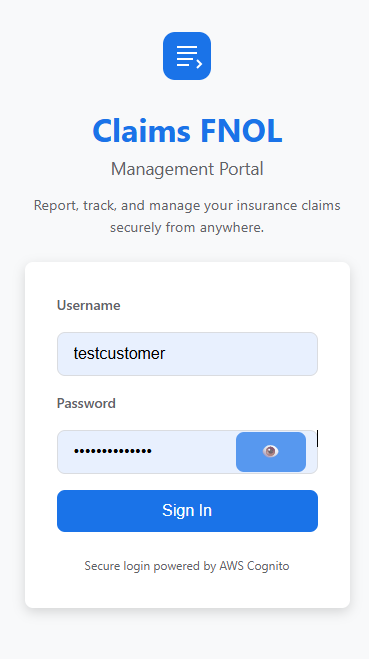
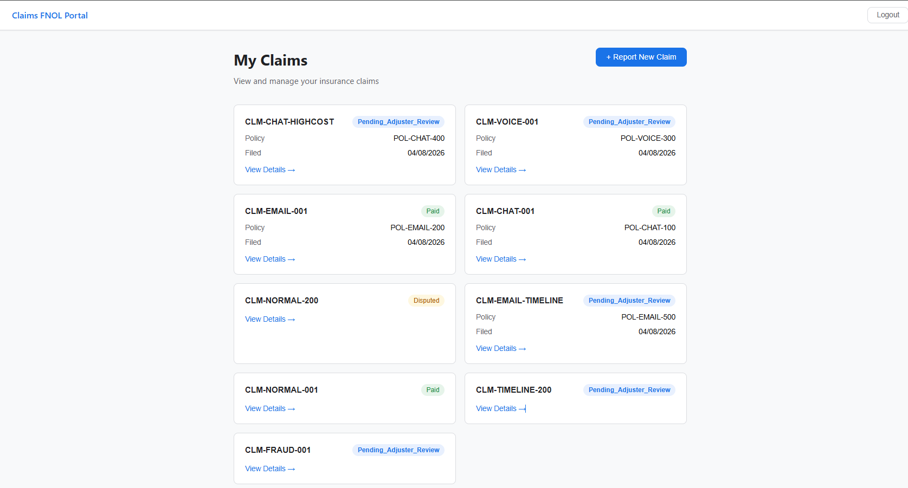
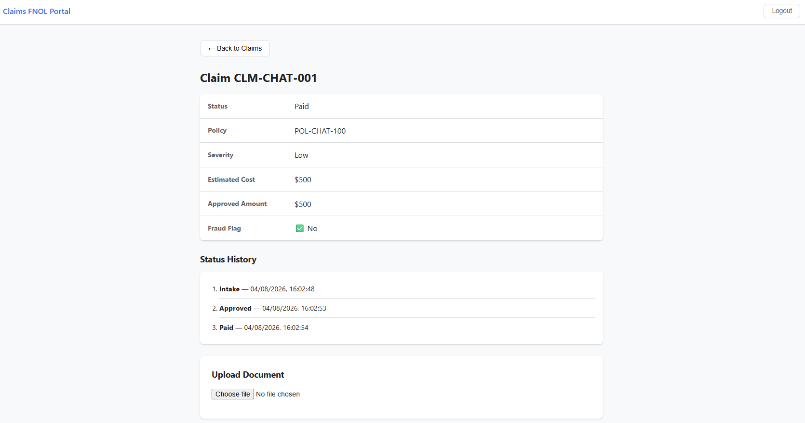
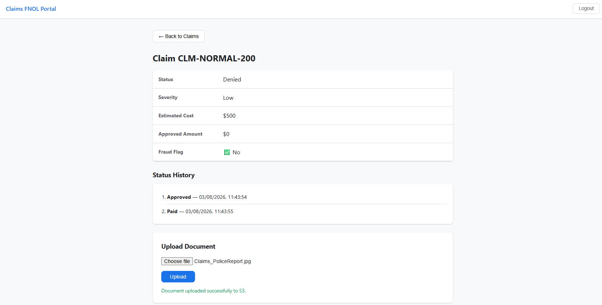
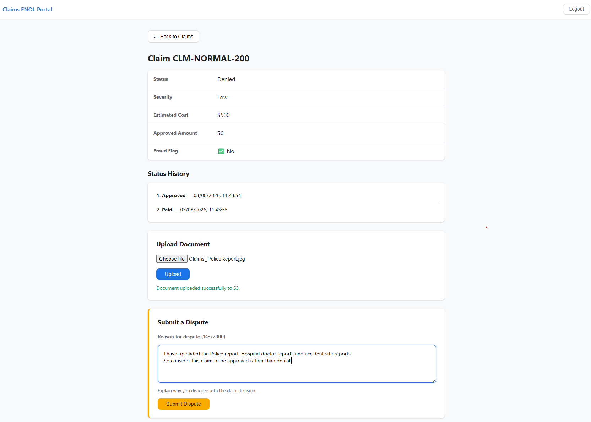
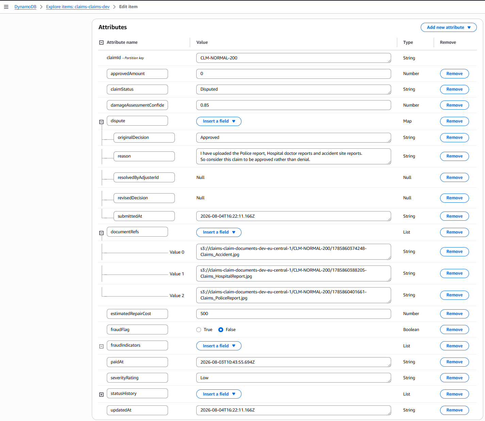
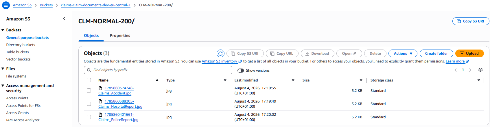

# Customer Portal Frontend

The Claims FNOL Management Portal is a React SPA deployed on AWS S3 static hosting, authenticated via Amazon Cognito, and backed by the Claims Management API (API Gateway + Lambda + DynamoDB).

**Live URL:** http://claims-portal-frontend-618257308782.s3-website.eu-central-1.amazonaws.com

**Test Credentials:**
- Username: `testcustomer`
- Password: *(configured in Cognito User Pool)*

---

## 1. Login Screen

The login screen authenticates customers via Amazon Cognito (USER_PASSWORD_AUTH flow). It displays a generic "Invalid username or password" message on any authentication failure — never revealing whether the username or password was incorrect (Req 9.2).

**Features:**
- Claims FNOL branding with logo
- Password visibility toggle (eye icon)
- Session-expired notification for re-authentication
- Secure login powered by AWS Cognito
- Generic error message (no information leakage)

### Screenshot


---

## 2. Claims Dashboard

After login, the customer sees all their claims in a card grid layout. Each card shows the claim ID, status badge (color-coded), policy number, and filing date.

**Features:**
- Responsive card grid layout
- Color-coded status badges:
  - 🟢 Green: Paid, Approved
  - 🔴 Red: Denied
  - 🟡 Amber: Disputed
  - 🔵 Blue: Pending_Adjuster_Review
- Policy number and creation date
- "View Details →" action on each card
- Empty state with helpful message when no claims exist
- Logout button in top navigation

**Claims visible in dashboard:**
- CLM-CHAT-HIGHCOST — Pending_Adjuster_Review (POL-CHAT-400)
- CLM-VOICE-001 — Pending_Adjuster_Review (POL-VOICE-300)
- CLM-EMAIL-001 — Paid (POL-EMAIL-200)
- CLM-CHAT-001 — Paid (POL-CHAT-100)
- CLM-NORMAL-200 — Denied
- CLM-EMAIL-TIMELINE — Pending_Adjuster_Review (POL-EMAIL-500)
- CLM-NORMAL-001 — Paid
- CLM-TIMELINE-200 — Pending_Adjuster_Review
- CLM-FRAUD-001 — Pending_Adjuster_Review

### Screenshot


---

## 3. Claim Detail View

Clicking a claim card opens the detail view showing the full claim information and status history timeline. Example shown: `CLM-CHAT-001` (Paid, $500).

**Features:**
- Claim summary table (status, policy, severity, estimated cost, approved amount, fraud flag)
- Complete status history as a numbered timeline (Intake → Approved → Paid)
- Back navigation to claims list
- Document Upload section
- Dispute Submission section (only for Approved/Denied claims)

### Screenshot


---

## 4. Document Upload

Customers can upload supporting documents (PDF, JPEG, PNG) for their claims. The component performs client-side validation before uploading. Example shown: uploading `Claims_PoliceReport.jpg` to `CLM-NORMAL-200`.

**Features:**
- File picker with format filtering (PDF, JPEG, PNG only)
- Client-side validation:
  - Rejects unsupported formats before upload
  - Rejects files exceeding 10MB size limit
- Pre-signed S3 URL for direct upload (no file passes through Lambda)
- "Document uploaded successfully to S3." confirmation message
- File stored in S3 `claim-documents` bucket
- Document reference recorded in DynamoDB

### Screenshot


---

## 5. Dispute Submission

Customers can dispute a claim decision (Approved or Denied). The dispute form only appears when the claim is in a disputable status. Example shown: disputing `CLM-NORMAL-200` (Denied) with reason: "I have uploaded the Police report, Hospital doctor reports and accident site reports. So consider this claim to be approved rather than denial."

**Features:**
- Form only visible for claims with status Approved or Denied
- Character counter showing current/max length (143/2000)
- Client-side validation:
  - Reason must not be empty
  - Reason must be within 2000 characters
- Success confirmation on submission
- Claim status changes to "Disputed" in DynamoDB
- Dispute record stored with reason, timestamp, and original decision

### Screenshot


---

## 6. Logout

The top navigation bar appears on all screens (except login) with a logout button that clears the session and returns to the login screen.

---

## 7. DynamoDB — Claim State After Portal Actions

After performing actions through the portal (uploading documents, submitting disputes), the claim state is persisted in DynamoDB. Shown: `CLM-NORMAL-200` after uploading 3 documents and submitting a dispute.

**DynamoDB Table:** `claims-claims-dev`

**Fields visible in screenshot:**

| Field | Value |
|---|---|
| claimId | CLM-NORMAL-200 |
| claimStatus | Disputed |
| approvedAmount | 0 |
| damageAssessmentConfidence | 0.85 |
| estimatedRepairCost | 500 |
| fraudFlag | false |
| severityRating | Low |
| dispute.originalDecision | Approved |
| dispute.reason | I have uploaded the Police report, Hospital doctor reports and accident site reports. So consider this claim to be approved rather than denial. |
| dispute.submittedAt | 2026-08-04T16:22:11.166Z |
| documentRefs | 3 documents (Claims_Accident.jpg, Claims_HospitalReport.jpg, Claims_PoliceReport.jpg) |
| paidAt | 2026-08-03T10:43:55.694Z |

### Screenshot


---

## 8. S3 — Uploaded Documents

Documents uploaded through the portal are stored in the S3 bucket `claims-claim-documents-dev-eu-central-1`, organized by claim ID. Shown: 3 documents uploaded for `CLM-NORMAL-200`.

**S3 Bucket:** `claims-claim-documents-dev-eu-central-1`

**S3 Console:** https://s3.console.aws.amazon.com/s3/buckets/claims-claim-documents-dev-eu-central-1?region=eu-central-1

**Structure:**
```
claims-claim-documents-dev-eu-central-1/
└── CLM-NORMAL-200/
    ├── 1785860374248-Claims_Accident.jpg         (5.2 KB, Aug 4 2026 17:19:35)
    ├── 1785860388205-Claims_HospitalReport.jpg   (5.2 KB, Aug 4 2026 17:19:49)
    └── 1785860401661-Claims_PoliceReport.jpg     (5.2 KB, Aug 4 2026 17:20:02)
```

Each uploaded file is:
- Stored with KMS server-side encryption
- Named with timestamp prefix for uniqueness
- Referenced in the claim's `documentRefs` array in DynamoDB

### Screenshot


---

## Architecture

```
┌──────────────────┐        ┌───────────────────┐        ┌──────────────────┐
│   S3 Static      │        │   API Gateway     │        │   DynamoDB       │
│   Website        │───────▶│   + Lambda        │───────▶│   Claims Table   │
│   (React SPA)    │        │                   │        │                  │
└──────────────────┘        └───────────────────┘        └──────────────────┘
         │                           │
         │                           ▼
         ▼                  ┌───────────────────┐
┌──────────────────┐        │   S3 Documents    │
│   Cognito        │        │   Bucket          │
│   User Pool      │        │   (pre-signed)    │
└──────────────────┘        └───────────────────┘
```

---

## Technology Stack

| Component | Technology |
|---|---|
| Framework | React 18 + TypeScript |
| Build tool | Vite 5 |
| Hosting | AWS S3 Static Website |
| Authentication | Amazon Cognito (direct API call) |
| API | API Gateway REST API |
| File uploads | S3 pre-signed URLs |
| Styling | Custom CSS (no framework) |
