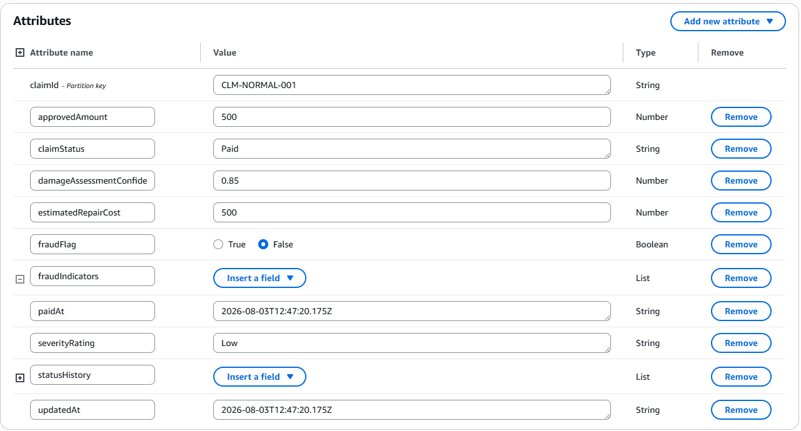
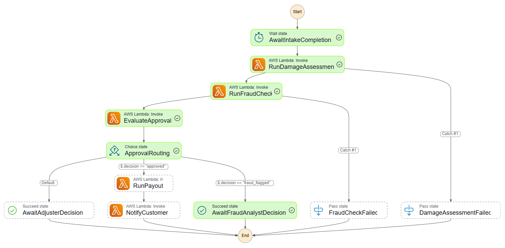
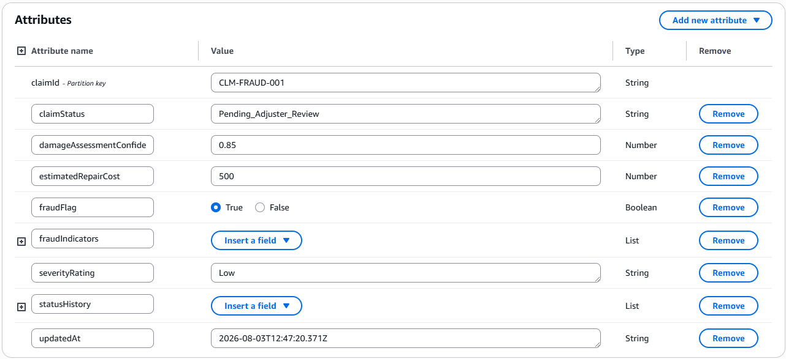
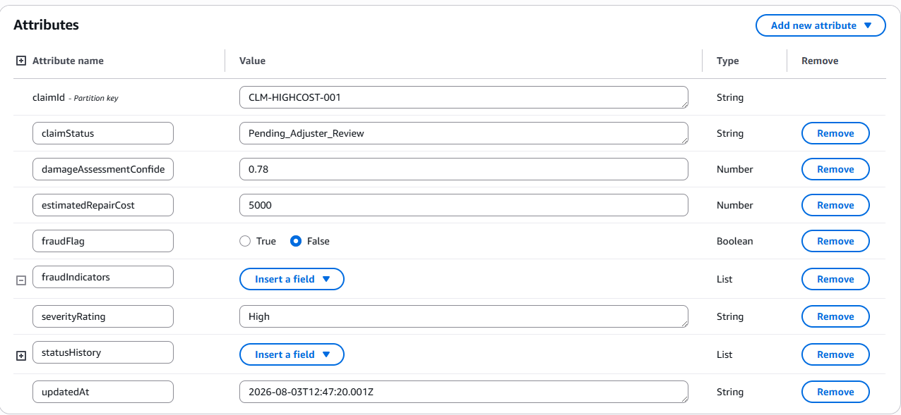

# Step Functions — Claim Lifecycle Scenarios

This document demonstrates four claims lifecycle scenarios executed via the AWS Step Functions state machine (`claims-claim-lifecycle-dev`), showing how different inputs produce different decision paths with full DynamoDB persistence.

---

## Architecture: Claim Lifecycle State Machine

```
Intake → Damage Assessment → Fraud Check → Evaluate Approval → [Decision Path]
```

Decision paths:
- **Auto-Approve** → Payout → Notify Customer (SUCCEEDED)
- **Fraud Flagged** → Await Analyst Review (SUSPENDED)
- **High Cost / High Severity** → Await Adjuster Review (SUSPENDED)

---

## Scenario 1: Normal Claim (Auto-Approved → Paid $500)

### Input
```json
{
  "claimId": "CLM-NORMAL-001",
  "policyNumber": "POL-100",
  "priorClaimCount": 1
}
```

### Decision Logic
| Check | Value | Threshold | Result |
|---|---|---|---|
| Prior claim count | 1 | > 3 triggers fraud | ✅ No fraud |
| Severity rating | Low | > Low triggers adjuster | ✅ Within limit |
| Estimated repair cost | $500 | > $2000 triggers adjuster | ✅ Within limit |

### Flow
```
AwaitIntakeCompletion → RunDamageAssessment → RunFraudCheck → EvaluateApproval → RunPayout → NotifyCustomer
```

### DynamoDB Result
| Field | Value |
|---|---|
| claimId | CLM-NORMAL-001 |
| claimStatus | Paid |
| severityRating | Low |
| estimatedRepairCost | 500 |
| damageAssessmentConfidence | 0.85 |
| approvedAmount | 500 |
| paidAt | 2026-08-03T... (UTC) |
| fraudFlag | false |
| fraudIndicators | [] |

### Outcome: ✅ SUCCEEDED — Customer paid $500
- Claim auto-approved (no fraud, low severity, cost within threshold)
- Payment of $500 initiated with claimId as idempotency key
- Customer notified via original channel

### Screenshot


### DynamoDB Screenshot


---

## Scenario 2: Fraud Claim (High Frequency — Flagged, No Payout)

### Input
```json
{
  "claimId": "CLM-FRAUD-001",
  "policyNumber": "POL-200",
  "priorClaimCount": 5
}
```

### Decision Logic
| Check | Value | Threshold | Result |
|---|---|---|---|
| Prior claim count | 5 | > 3 triggers fraud | ❌ **FRAUD DETECTED** |
| Fraud indicator | ClaimFrequency | confidence: 0.67 | Flagged |

### Flow
```
AwaitIntakeCompletion → RunDamageAssessment → RunFraudCheck → EvaluateApproval → AwaitFraudAnalystDecision [STOPPED]
```

### DynamoDB Result
| Field | Value |
|---|---|
| claimId | CLM-FRAUD-001 |
| claimStatus | Pending_Adjuster_Review |
| severityRating | Low |
| estimatedRepairCost | 500 |
| damageAssessmentConfidence | 0.85 |
| approvedAmount | *(not present — never approved)* |
| paidAt | *(not present — no payout)* |
| fraudFlag | true |
| fraudIndicators | [{type: "ClaimFrequency", confidenceScore: 0.67}] |

### Fraud Indicator Details
```json
{
  "type": "ClaimFrequency",
  "confidenceScore": 0.67,
  "detectedAt": "2026-08-03T..."
}
```

### Outcome: 🚨 FRAUD FLAGGED — No payout, pending analyst review
- 5 claims within the rolling window exceeds threshold of 3
- Claim suspended pending Fraud Analyst review
- In production: analyst reviews and either clears (resumes lifecycle) or denies

### Screenshot


### DynamoDB Screenshot


---

## Scenario 3: Timeline Discrepancy (Suspicious Dates — Flagged, No Payout)

### Input
```json
{
  "claimId": "CLM-TIMELINE-001",
  "policyNumber": "POL-300",
  "incidentDate": "2026-08-15T00:00:00Z",
  "claimCreatedDate": "2026-07-28T00:00:00Z"
}
```

### Decision Logic
| Check | Value | Issue | Result |
|---|---|---|---|
| Incident date | 2026-08-15 | **After** claim creation (2026-07-28) | ❌ **DISCREPANCY** |
| Fraud indicator | TimelineDiscrepancy | confidence: 0.9 | Flagged |

### Flow
```
AwaitIntakeCompletion → RunDamageAssessment → RunFraudCheck → EvaluateApproval → AwaitFraudAnalystDecision [STOPPED]
```

### DynamoDB Result
| Field | Value |
|---|---|
| claimId | CLM-TIMELINE-001 |
| claimStatus | Pending_Adjuster_Review |
| severityRating | Low |
| estimatedRepairCost | 500 |
| damageAssessmentConfidence | 0.85 |
| approvedAmount | *(not present — never approved)* |
| paidAt | *(not present — no payout)* |
| fraudFlag | true |
| fraudIndicators | [{type: "TimelineDiscrepancy", confidenceScore: 0.9}] |

### Why This Is Suspicious
The reported incident date (August 15, 2026) is **after** the claim was filed (July 28, 2026). This means the customer is reporting damage that supposedly hasn't happened yet — a strong indicator of fraudulent intent.

### Outcome: 🚨 FRAUD FLAGGED — No payout, pending analyst review
- Timeline inconsistency detected (incident in the future relative to claim filing)
- High confidence score (0.9) due to clear logical impossibility
- Claim suspended pending Fraud Analyst review

### Screenshot


### DynamoDB Screenshot


---

## Scenario 4: High-Cost Claim (Exceeds Threshold — Routed to Adjuster)

### Input
```json
{
  "claimId": "CLM-HIGHCOST-001",
  "policyNumber": "POL-400",
  "priorClaimCount": 1,
  "estimatedRepairCost": 5000
}
```

### Decision Logic
| Check | Value | Threshold | Result |
|---|---|---|---|
| Prior claim count | 1 | > 3 triggers fraud | ✅ No fraud |
| Severity rating | High | > Low triggers adjuster | ❌ **EXCEEDS THRESHOLD** |
| Estimated repair cost | $5,000 | > $2,000 triggers adjuster | ❌ **EXCEEDS THRESHOLD** |

### Flow
```
AwaitIntakeCompletion → RunDamageAssessment → RunFraudCheck → EvaluateApproval → AwaitAdjusterDecision [STOPPED]
```

### DynamoDB Result
| Field | Value |
|---|---|
| claimId | CLM-HIGHCOST-001 |
| claimStatus | Pending_Adjuster_Review |
| severityRating | High |
| estimatedRepairCost | 5000 |
| damageAssessmentConfidence | 0.78 |
| approvedAmount | *(not present — awaiting adjuster)* |
| paidAt | *(not present — no payout yet)* |
| fraudFlag | false |
| fraudIndicators | [] |

### Why This Goes to an Adjuster
The claim has no fraud indicators but the damage is too expensive ($5,000 vs $2,000 threshold) and too severe (High vs Low threshold) for automatic approval. A human adjuster must review the evidence and decide:
- **Approve** at the full $5,000 or a negotiated amount
- **Deny** if the claim is not covered

### Outcome: ⏸️ PENDING ADJUSTER — Awaiting human decision
- No fraud detected, but claim exceeds auto-approval thresholds
- Routed to Human Adjuster queue for manual review
- Adjuster will set the final approved amount

### Screenshot


### DynamoDB Screenshot


---

## How to Reproduce

### Via AWS Step Functions Console
1. Open: https://eu-central-1.console.aws.amazon.com/states/home?region=eu-central-1
2. Click **claims-claim-lifecycle-dev**
3. Click **Start execution**
4. Paste any of the input JSONs above
5. Observe the execution flow visually

### Via Postman
Use the **Step Functions** folder in the Postman collection with AWS Signature auth.

### Check Results in DynamoDB
- Console: https://eu-central-1.console.aws.amazon.com/dynamodbv2/home?region=eu-central-1#table?name=claims-claims-dev
- Click **Explore table items** to see all claims and their statuses

---

## Decision Thresholds (from SystemConfig)

| Parameter | Value | Effect |
|---|---|---|
| fraudFrequencyThreshold | 3 | > 3 claims in window → fraud flag |
| autoApprovalThreshold.maxSeverityRating | Low | > Low → route to adjuster |
| autoApprovalThreshold.maxEstimatedRepairCost | $2,000 | > $2,000 → route to adjuster |
| Timeline check | incidentDate > claimCreatedDate | → fraud flag (logical impossibility) |

---

## State Machine Diagram

```
┌──────────────────────────┐
│  AwaitIntakeCompletion   │
└────────────┬─────────────┘
             │
┌────────────▼─────────────┐
│   RunDamageAssessment    │ → severity, cost, confidence
└────────────┬─────────────┘
             │
┌────────────▼─────────────┐
│      RunFraudCheck       │ → frequency + timeline + watchlist
└────────────┬─────────────┘
             │
┌────────────▼─────────────┐
│     EvaluateApproval     │ → decision table
└────────────┬─────────────┘
             │
     ┌───────┼────────┐
     │       │        │
  approved  fraud   high cost/
     │     flagged   severity
     │       │        │
┌────▼──┐ ┌──▼─────┐ ┌──▼─────┐
│Payout │ │ Await  │ │ Await  │
│ $500  │ │ Fraud  │ │Adjuster│
│       │ │Analyst │ │Decision│
└───┬───┘ └────────┘ └────────┘
    │       (STOP)     (STOP)
┌───▼────────┐
│  Notify    │
│  Customer  │
└────────────┘
    (DONE)
```

---

## Audit Log Records

Each decision produces an audit record in `claims-audit-log-dev`:

| Scenario | decisionType | confidenceScore | Logged |
|---|---|---|---|
| Normal → Approved | Approval | 0.95 | ✅ |
| Normal → Paid | Payout | 1.0 | ✅ |
| Fraud → Pending | Approval | 0.5 | ✅ |
| High Cost → Pending | Approval | 0.95 | ✅ |
