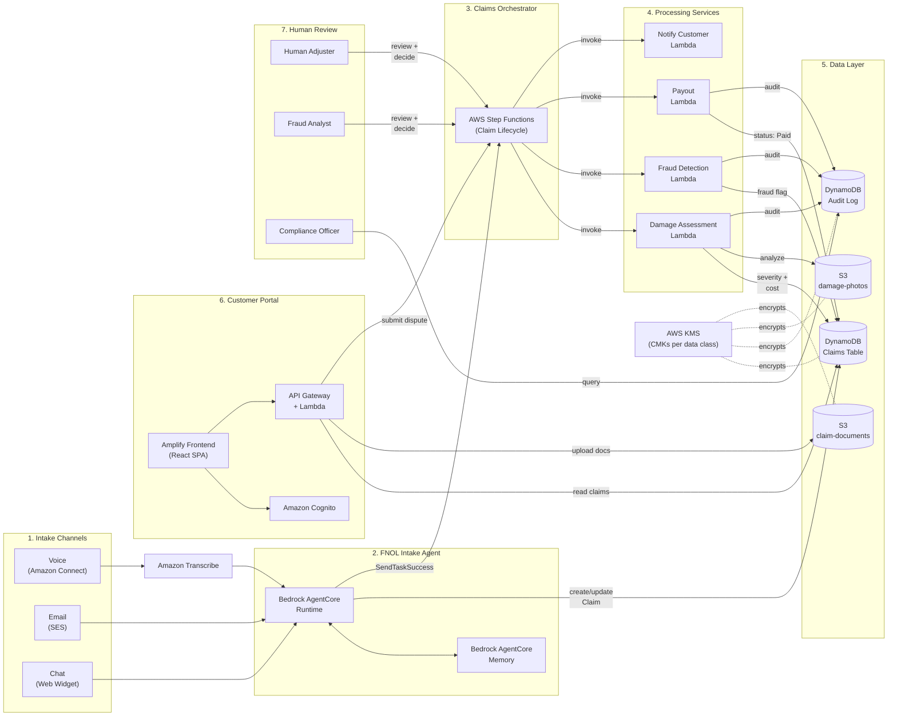
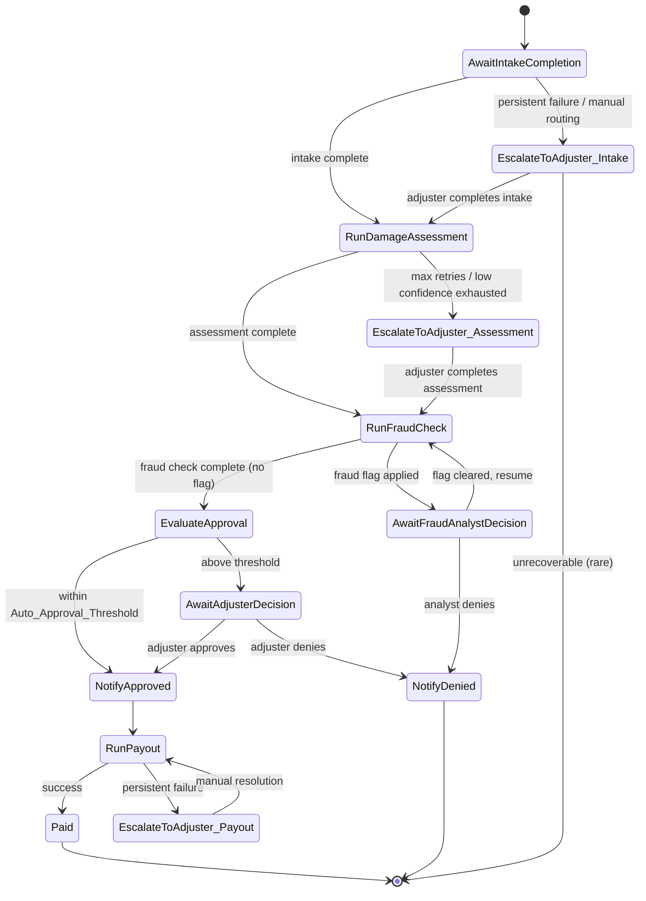
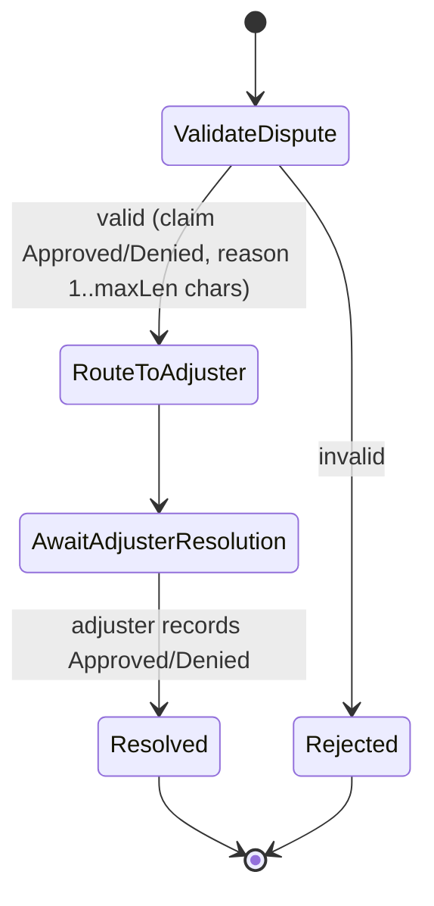

# Design Document: Claims Management and FNOL System

## Overview

The Claims Management and FNOL system is an event-driven, serverless application on AWS that automates First Notice of Loss intake, damage assessment, fraud screening, and claim lifecycle orchestration for a property/casualty insurer. It exposes three intake channels (voice, email, chat), a self-service customer portal, and a set of human-review queues for adjusters, fraud analysts, and compliance officers.

The system is built around five cooperating subsystems:

1. **FNOL Intake Agent** — a Bedrock AgentCore agent that receives claim reports from voice (via Amazon Transcribe), email, and chat, extracts `Structured_Claim_Fields`, and maintains cross-channel conversation continuity using AgentCore Memory.
2. **Damage Assessment Service** — a Lambda-based service that invokes Amazon Rekognition against uploaded photos to derive a `Severity_Rating`, estimated repair cost, and confidence score.
3. **Fraud Detection Service** — a Lambda-based service that evaluates claim frequency, timeline consistency, and sanctions/watchlist screening to produce `Fraud_Indicator`s and `Fraud_Flag`s.
4. **Claims Orchestrator** — an AWS Step Functions state machine that drives each `Claim` through its lifecycle (`Intake` → `Assessment` → `Fraud_Check` → `Payout`/`Disputed`), with retry/backoff and escalation to human queues.
5. **Customer Portal** — an Amplify-hosted web application, authenticated with Amazon Cognito, for status tracking, document upload, and dispute submission.

All claim state lives in DynamoDB, all binary evidence (photos, documents) lives in S3, and every automated decision is written to an append-only audit log before it is allowed to take effect (Requirement 8.6). PII is encrypted at rest (KMS) and in transit (TLS) throughout (Requirement 12).

### Design Goals

- **Channel parity**: voice, email, and chat all converge on the same structured extraction and session model, so the orchestrator and downstream services never need to know which channel a claim originated from (except for final notification routing).
- **Straight-through processing for low-risk claims**, with deterministic, auditable escalation rules for everything else.
- **Fail-safe compliance**: no automated decision (approval, denial, fraud flag) can take effect unless it is durably logged first.
- **Least-privilege access**: every role (Customer, Human_Adjuster, Fraud_Analyst, Compliance Officer, and each internal service) has a distinct IAM/Cognito-group identity with scoped permissions.

## Architecture

### System Context Diagram



### Key Architectural Decisions

| Decision | Rationale |
|---|---|
| Use Bedrock AgentCore **Runtime** for the intake agent, AgentCore **Memory** for `Claim_Session` context | Runtime provides session-isolated, serverless hosting of the agent's reasoning loop per channel interaction; Memory provides managed short-term (conversation) and long-term (cross-session, cross-channel) state without a bespoke conversation store. |
| Mirror session-critical fields into DynamoDB (`ClaimSessions` table) rather than relying on AgentCore Memory alone for lookup | AgentCore Memory is addressed by session/actor ID, not queryable by policy number. Requirement 3 requires resuming by `Claim_ID` **or policy number**, and requires detecting ambiguous matches (3.5), which needs a secondary index — DynamoDB GSI on `PolicyNumber` + `ClaimStatus`. |
| Model the Claims Orchestrator as a single Step Functions **Standard** workflow per claim, using `waitForTaskToken` for human/agent-in-the-loop stages | Standard workflows support long-running executions (claims can take days), exactly-once semantics, and native task-token callbacks so the state machine can pause for intake completion, adjuster decisions, and fraud analyst decisions without polling. |
| Separate **Dispute Resolution** as its own Step Functions workflow, started on dispute submission, rather than resuming the original execution | The original execution already reached a terminal state (`Approved`/`Denied`) and stopped. Modeling dispute as a new, short workflow keeps the primary lifecycle state machine simple and matches Requirement 11's independent trigger (a later customer action). |
| Enforce "audit-log-write-before-decision-effect" (Requirement 8.6) as a synchronous pre-condition inside each decision-producing Lambda, not as a fire-and-forget event | An async/eventual audit pipeline could let a decision (e.g., approval) take effect before the audit record durably exists, violating 8.6. Each decision Lambda calls the Audit Log Service synchronously and only proceeds (returns success / advances Claim_Status) if the write succeeds. |
| Use DynamoDB with a `PutItem` **condition expression** (`attribute_not_exists`) plus no update/delete IAM permissions on the Audit Log table for any role | Gives an easily verifiable immutability guarantee (Requirement 8.2) without needing a separate ledger service. |

## Components and Interfaces

### 1. Intake Channel Adapters

- **Voice**: Amazon Connect contact flow streams caller audio to **Amazon Transcribe** (streaming API). Transcribed segments, together with a per-segment confidence score, are forwarded to the FNOL Intake Agent. Segments below the configured confidence threshold trigger a "please confirm/restate" prompt back through Connect (Req 1.5).
- **Email**: Inbound mail arrives via SES, triggering a Lambda that extracts the email body/attachments and invokes the FNOL Intake Agent with the raw text (Req 1.2).
- **Chat**: The Amplify web/chat widget calls the FNOL Intake Agent through a WebSocket or HTTP API (API Gateway), passing the raw chat message (Req 1.3).

All three adapters normalize into a single internal `ChannelMessage` shape (`channel`, `rawText`, `claimIdHint?`, `policyNumberHint?`, `timestamp`) before invoking the agent, so the agent's extraction logic is channel-agnostic.

### 2. FNOL Intake Agent (Bedrock AgentCore)

- Runs as a Bedrock AgentCore **Runtime** agent. Each channel interaction is a Runtime invocation scoped by a `sessionId` (initially the `Claim_ID` once known, or a temporary session id before a `Claim_ID` exists).
- Uses AgentCore **Memory** for short-term conversational state within a channel interaction, and a long-term memory strategy keyed by `Claim_ID` to carry `Structured_Claim_Fields` and their confirmation state across channel switches (Req 3.2).
- Exposes agent "tools" (function-calling targets) backed by Lambda:
  - `lookupClaimSession(claimId | policyNumber)` — queries the `ClaimSessions` DynamoDB GSI; returns 0, 1, or many matches (drives Req 3.1/3.4/3.5 disambiguation).
  - `extractFields(rawText)` — LLM-driven extraction returning `{ field, value, confidenceScore }[]` for policy number, incident date, incident location, damage description.
  - `upsertClaimSession(...)` — persists extracted/confirmed fields and attempt counters to DynamoDB.
  - `createClaim()` — allocates a new unique `Claim_ID` (ULID) and `Claim` record with `Claim_Status = Intake`.
  - `routeToAdjuster(claimId, reason)` — writes to the adjuster review queue and sets `Claim_Status = Pending_Adjuster_Review`.
  - `completeIntake(claimId)` — sets `Claim_Status = Assessment` and calls `SendTaskSuccess` on the Claims Orchestrator's pending intake task token.
- Enforces the attempt-bounded clarification rules from Requirement 2 (max 3 clarifying attempts per field, confirmation required below the confidence threshold) and Requirement 1 (max retries for unintelligible audio, max attempts to confirm/restate).

### 3. Damage Assessment Service

- Triggered by an S3 `ObjectCreated` event on the `damage-photos` bucket (via EventBridge) once a customer finishes uploading photos for a claim, or explicitly invoked when the customer marks upload complete.
- The **Upload Lambda** (fronting both the intake agent's upload tool and the portal's upload API) validates file format (JPEG/PNG/HEIC) and size (configurable max, e.g., 10 MB) *before* writing to S3; invalid files are rejected without any S3 write (Req 4.4, 4.5).
- The **Analysis Lambda** loads all photos currently associated with the claim, calls Rekognition (`DetectLabels` plus a custom-labels model trained to classify damage severity) for each photo, and aggregates per-photo results into one `Severity_Rating` (Low/Medium/High) and one estimated repair cost for the claim, with an overall confidence score (Req 4.2, 4.3).
- If Rekognition signals low-confidence/ambiguous results, the Lambda increments a `photoResubmissionCount` on the claim and, if under the configured max, requests clearer photos; once the max is exhausted (or a non-quality failure occurs, or confidence stays below threshold), it calls `routeToAdjuster` and sets `Claim_Status = Pending_Adjuster_Review` (Req 4.6, 4.7).
- On success, it calls `SendTaskSuccess` on the orchestrator's pending assessment task token.

### 4. Fraud Detection Service

- A Lambda invoked synchronously by the Claims Orchestrator when a claim enters `Fraud_Check`.
- **Frequency check**: queries the Claims table GSI on `PolicyNumber`/`CustomerId` for claims within the configured time window; flags a frequency indicator if count exceeds the configured threshold (Req 6.1).
- **Timeline check**: cross-validates `incidentDate`, `incidentLocation`, and any event-sequence metadata captured during intake for internal inconsistency (Req 6.2).
- **Watchlist screening**: calls an external sanctions/watchlist screening API (abstracted behind an interface so the provider can be swapped) with the customer's identity attributes (Req 6.3).
- If any indicator fires, the Lambda applies a `Fraud_Flag`, records indicators with confidence scores on the claim, writes the audit record, and returns control to the orchestrator, which routes to the Fraud Analyst queue and suspends payout (Req 6.4, 6.5).
- Analyst decisions are recorded via a `resolveFraudReview(claimId, analystId, decision)` API (Portal-side, adjuster-facing) that either clears the flag and re-invokes `Fraud_Check`, or sets `Claim_Status = Denied` (Req 6.6).

### 5. Claims Orchestrator (AWS Step Functions)

State machine name: `ClaimLifecycleWorkflow`, one execution per `Claim_ID` (execution name = `Claim_ID` for idempotent-start protection).



Each `Await*`/`Run*` task follows this pattern:

- **Task tokens** (`AwaitIntakeCompletion`, `AwaitFraudAnalystDecision`, `AwaitAdjusterDecision`) use `.waitForTaskToken` and are resolved by `SendTaskSuccess`/`SendTaskFailure` calls from the intake agent, portal adjuster APIs, or fraud analyst APIs.
- **Direct Lambda invocations** (`RunDamageAssessment`, `RunFraudCheck`, `RunPayout`) use a **Retry** block:
  ```json
  {
    "Retry": [{
      "ErrorEquals": ["Claims.TransientFailure"],
      "IntervalSeconds": 5,
      "MaxAttempts": 3,
      "BackoffRate": 2.0
    }],
    "Catch": [{
      "ErrorEquals": ["Claims.PersistentFailure", "States.ALL"],
      "Next": "EscalateToAdjuster_<Stage>"
    }]
  }
  ```
  satisfying Requirement 7.2/7.3 (max 3 attempts, configured backoff, escalate on persistent failure).
- Every state transition writes a `StatusHistory` entry (`{status, timestamp}`) to the Claim record via a small "record transition" Lambda invoked on entry to each state (Req 7.6).
- `NotifyApproved`, `NotifyDenied`, and `Paid` each invoke a **Notify Customer** Lambda that looks up the claim's original intake channel and sends status notifications through that channel (Req 7.8).

**Dispute Resolution Workflow** (`DisputeResolutionWorkflow`, separate state machine, started by the Portal's dispute API):



### 6. Audit Log Service

- A dedicated Lambda (`recordAutomatedDecision`) called synchronously, in-line, by every decision-producing component (intake agent's field-confirmation decisions, Damage Assessment, Fraud Detection, adjuster/analyst decision handlers, Payout, Dispute resolution).
- Writes an append-only item to the `AuditLog` DynamoDB table using `PutItem` with `ConditionExpression: attribute_not_exists(LogId)`; no IAM principal is granted `UpdateItem`/`DeleteItem` on this table (enforces Req 8.2).
- The calling component only proceeds with the decision's side effects (status change, payout trigger, etc.) after the audit write succeeds; on failure, the component raises `Claims.AuditFailure`, which is treated as a persistent failure by the orchestrator (Req 8.6).
- A query API (`GET /audit/claims/{claimId}`), gated by a Cognito `ComplianceOfficer` group claim via an API Gateway Lambda authorizer, returns records in chronological order (Req 8.4); requests without that group claim receive `403` (Req 8.5).

### 7. Customer Portal

- **Frontend**: An Amplify-hosted single-page application, using **React** (Amplify's default/most common frontend framework) as the chosen UI framework, bootstrapped via the Amplify CLI/Gen 2 project scaffold. The app uses the Amplify Auth library against the Cognito User Pool for authentication, and the Amplify API/Storage libraries for calling the Portal API (API Gateway) and for S3 document/photo uploads (Req 9.1).
  - **Key screens/views**:
    - **Login/Authentication screen**: username + password form; on failure, displays the generic invalid-credential error message returned by the backend without distinguishing which field was wrong (Req 9.2); on session expiry, presents a re-authentication prompt in place of (not instead of preserving) the customer's in-progress view state (Req 9.6).
    - **Claims List/Dashboard view**: lists the claims scoped to the authenticated customer (i.e., only claims the Portal API returns for that `sub`), as the landing view after login.
    - **Claim Detail/Status view**: shows the claim's current `Claim_Status` plus its full `statusHistory` as a timeline, sourced from `GET /claims/{id}` (Req 10.1).
    - **Document Upload component**: a file picker that performs client-side format/size pre-validation mirroring the backend validator (Property 17) before submitting, shows upload progress, and displays an explicit success or failure confirmation once `POST /claims/{id}/documents` responds (Req 10.2, 10.3, 10.4).
    - **Dispute Submission form**: rendered only when the displayed claim's status is `Approved` or `Denied`; contains a reason text field with client-side length validation mirroring the configured `maxDisputeReasonLength` before submitting to `POST /claims/{id}/disputes` (Req 11.1, 11.4, 11.5).
  - **State/data-fetching**: All screens read/write claim data exclusively through the existing Portal API endpoints described below (`GET /claims/{id}`, `POST /claims/{id}/documents`, `POST /claims/{id}/disputes`), authenticated by attaching the Amplify Auth session token (Cognito ID/access token) to each request; no claim data is fetched or cached outside of these calls.
  - **Deployment**: Amplify Hosting, using Amplify's standard git-branch-based CI/CD (build and deploy on push to the configured branch).
  - Frontend behavior above is UI-level (screen composition, client-side pre-validation mirroring, session-timeout prompting) and is out-of-scope for property-based testing per this design's PBT-applicability classification (see Correctness Properties); it is covered by unit/example-based and snapshot-style tests instead.
- **Auth**: Cognito User Pool with:
  - Password policy and standard Cognito advanced security features.
  - Account lockout: Cognito's built-in adaptive authentication is supplemented by a Lambda `PreAuthentication` trigger that tracks consecutive failed attempts per user in DynamoDB (`FailedLoginAttempts` table, TTL-based 15-minute window) and denies auth attempts once 5 consecutive failures occur within 15 minutes, until the 15-minute lockout expires (Req 9.3).
  - Generic invalid-credential error message (no username/password distinction) surfaced by the frontend regardless of the underlying Cognito error code (Req 9.2).
  - Session/token expiry configured for 15 minutes by default (configurable 5–30 min) via Cognito token validity + frontend idle-timer that forces re-authentication (Req 9.6).
- **API**: API Gateway + Lambda (`PortalAPI`), authorized via a Cognito authorizer. Every claim-scoped endpoint (`GET /claims/{id}`, `POST /claims/{id}/documents`, `POST /claims/{id}/disputes`) loads the claim's policyholder/claimant list and compares it against the authenticated `sub`/customer id **before** any data access; mismatches return `403` with a generic "claim not accessible" message (Req 9.4, 9.5, 10.5, 10.6).
- **Document upload**: `POST /claims/{id}/documents` reuses the same validate-before-store pattern as damage photos (format/size check prior to S3 write) (Req 10.2, 10.3), and returns an explicit success confirmation payload (Req 10.4).
- **Status view**: `GET /claims/{id}` returns `Claim_Status` plus the full `StatusHistory` array (Req 10.1).
- **Dispute submission**: `POST /claims/{id}/disputes` validates `Claim_Status ∈ {Approved, Denied}` and a non-empty, length-bounded reason, then starts the `DisputeResolutionWorkflow` execution (Req 11.1, 11.4, 11.5).

### 8. Security & Data Protection

- **At rest**: All DynamoDB tables use KMS-encrypted (customer-managed CMK) server-side encryption; both S3 buckets (`damage-photos`, `claim-documents`) use SSE-KMS with the same or scoped CMKs (Req 12.1).
- **In transit**: API Gateway enforces TLS 1.2+; S3 bucket policies require `aws:SecureTransport`; internal service-to-service calls (Lambda → DynamoDB/S3/Rekognition/Transcribe) use the AWS SDK's default TLS (Req 12.2).
- **Access control**: IAM roles are scoped per Lambda function (least privilege — e.g., the Damage Assessment Lambda has no access to the Audit Log table's underlying CMK beyond what's needed to write, Payout Lambda cannot read damage-photos bucket). Human roles are modeled as Cognito groups (`Customer`, `Human_Adjuster`, `Fraud_Analyst`, `ComplianceOfficer`); every internal API checks group membership before returning unencrypted PII fields (Req 12.3).
- **Unauthorized access logging**: API Gateway Lambda authorizers and the Portal API's authorization checks emit a denial event that is written to the Audit Log Service as a distinct `AccessDenied` record type whenever an unauthorized actor/component attempts to read PII (Req 12.4).

## Data Models

All primary tables use on-demand capacity and are encrypted with a customer-managed KMS key (see Security section).

### Claim (DynamoDB table `Claims`, PK `claimId`)

| Field | Type | Notes |
|---|---|---|
| `claimId` | string (ULID) | Partition key |
| `policyNumber` | string | GSI `PolicyNumberIndex` PK, for frequency checks and cross-channel lookup |
| `claimStatus` | string enum | `Intake`, `Assessment`, `Fraud_Check`, `Pending_Adjuster_Review`, `Approved`, `Denied`, `Paid`, `Disputed`, `Resolved` |
| `structuredFields` | map | `{ policyNumber: {value, confidenceScore, confirmed}, incidentDate: {...}, incidentLocation: {...}, damageDescription: {...} }` |
| `originalChannel` | string enum | `Voice`, `Email`, `Chat` — used for terminal-status notification routing |
| `photoRefs` | list<string> | S3 object keys in `damage-photos` |
| `documentRefs` | list<string> | S3 object keys in `claim-documents` |
| `severityRating` | string enum \| null | `Low`, `Medium`, `High` |
| `estimatedRepairCost` | number \| null | |
| `damageAssessmentConfidence` | number [0,1] \| null | |
| `photoResubmissionCount` | number | |
| `fraudFlag` | boolean | |
| `fraudIndicators` | list<{type, confidenceScore, detectedAt}> | |
| `statusHistory` | list<{status, timestamp}> | append-only, mirrors Req 7.6 |
| `adjusterId` | string \| null | recorded on adjuster approve/deny (Req 5.4/5.5) |
| `fraudAnalystId` | string \| null | recorded on fraud review decision (Req 6.6) |
| `dispute` | map \| null | `{reason, submittedAt, originalDecision, revisedDecision, resolvedByAdjusterId}` |
| `policyholderIds` | list<string> | Cognito customer ids authorized to view/act on this claim (Req 9.4) |
| `createdAt` / `updatedAt` | ISO-8601 string | |

### Claim_Session (DynamoDB table `ClaimSessions`, PK `claimId`)

| Field | Type | Notes |
|---|---|---|
| `claimId` | string | Partition key; also the AgentCore Memory session/actor scoping key |
| `policyNumber` | string \| null | GSI `PolicyNumberStatusIndex` (PK `policyNumber`, SK `claimStatus`) — supports Req 3.5 disambiguation query |
| `claimStatus` | string | mirrors `Claim.claimStatus` while `Intake`; used to filter resumable sessions |
| `channelHistory` | list<{channel, timestamp}> | which channels have touched this session |
| `fieldAttemptCounts` | map<string, number> | clarifying-question attempts per field (max 3, Req 2.3/2.6) |
| `voiceRetryCount` | number | unintelligible-audio retry counter (Req 1.6) |
| `confirmAttemptCounts` | map<string, number> | confirm/restate attempt counter (Req 1.8) |
| `expiresAt` | number (epoch) | TTL; session context is only meaningful while `Claim_Status = Intake` |

### AuditLogRecord (DynamoDB table `AuditLog`, PK `logId`, SK `claimId`)

| Field | Type | Notes |
|---|---|---|
| `logId` | string (ULID, monotonic) | Partition key; ULIDs are lexicographically sortable by creation time |
| `claimId` | string | GSI `ClaimIdIndex` (PK `claimId`, SK `logId`) for chronological per-claim queries (Req 8.4) |
| `decisionType` | string enum | `FieldExtraction`, `DamageAssessment`, `FraudFlag`, `Approval`, `Denial`, `Payout`, `DisputeResolution`, `AccessDenied` |
| `inputs` | map | decision-specific input snapshot (e.g., extracted text, photo refs, fraud signals) |
| `confidenceScore` | number [0,1] \| null | required for AI-driven decision types |
| `fraudIndicators` | list<{type, confidenceScore}> \| null | present when `decisionType = FraudFlag` (Req 8.3) |
| `timestamp` | ISO-8601 string | |
| `actorType` | string enum | `System`, `HumanAdjuster`, `FraudAnalyst`, `Customer` |
| `actorId` | string \| null | adjuster/analyst/customer id when applicable |

### DisputeRecord (embedded in `Claim.dispute`, referenced from `AuditLog`)

| Field | Type | Notes |
|---|---|---|
| `reason` | string | 1..`maxDisputeReasonLength` chars |
| `submittedAt` | ISO-8601 string | |
| `originalDecision` | string enum | `Approved` \| `Denied` |
| `revisedDecision` | string enum \| null | `Approved` \| `Denied`, set on resolution |
| `resolvedByAdjusterId` | string \| null | |

### CustomerAccount (Cognito User Pool, custom attributes)

| Field | Type | Notes |
|---|---|---|
| `sub` | string | Cognito subject, primary customer id |
| `custom:policyholderIds` | string (JSON list) | policy numbers/claimant ids this account may access; synced into `Claim.policyholderIds` |
| Cognito group | `Customer` \| `Human_Adjuster` \| `Fraud_Analyst` \| `ComplianceOfficer` | role for authorization checks |

### Configuration values referenced above

`transcriptionConfidenceThreshold`, `fieldConfidenceThreshold`, `maxClarifyingAttempts` (3), `maxVoiceRetries`, `maxConfirmAttempts`, `maxPhotosPerClaim`, `supportedImageFormats`, `maxPhotoFileSizeBytes`, `maxPhotoResubmissions`, `damageAssessmentConfidenceThreshold`, `autoApprovalThreshold` (severity + cost ceiling), `fraudFrequencyThreshold`/`fraudFrequencyWindow`, `stageRetryMaxAttempts` (3), `stageRetryBackoffSeconds`, `auditRetentionPeriod`, `sessionTimeoutMinutes` (default 15, range 5–30), `maxDisputeReasonLength`, `supportedDocumentFormats`, `maxDocumentFileSizeBytes` — all stored in a central `SystemConfig` table or Parameter Store, read by the relevant Lambdas at invocation time.

## Correctness Properties

*A property is a characteristic or behavior that should hold true across all valid executions of a system-essentially, a formal statement about what the system should do. Properties serve as the bridge between human-readable specifications and machine-verifiable correctness guarantees.*

The prework analysis above identified the pure-logic decision points (field resolution, threshold/counter rules, decision tables, authorization predicates, audit invariants, and state-machine conformance) as suitable for property-based testing, and separated out infrastructure wiring (Transcribe/Rekognition/watchlist calls, KMS/TLS configuration, Cognito auth-gate presence, audit-table immutability permissions) which are validated with integration/smoke tests instead. The reflection pass below consolidates properties that test the same underlying decision function from multiple acceptance criteria.

### Property Reflection (Redundancy Consolidation)

- Requirements 2.3 and 2.6 both describe the same clarifying-question attempt counter (ask while under the max, escalate once exhausted) — merged into **Property 7**.
- Requirements 3.1, 3.2, and 3.3 all describe the single "session persistence across channels while Intake" behavior (retrieve captured fields, don't re-ask confirmed ones) — merged into **Properties 11 and 12**.
- Requirements 4.4/4.5 (photo validation) and 10.2/10.3 (document validation) implement the same format/size validation predicate against two upload endpoints — merged into **Property 17**, applied to both evidence types.
- Requirements 4.6 and 4.7 describe one resubmission-then-escalation lifecycle rather than two separate rules — merged into **Property 18**.
- Requirements 5.1, 5.2, and 5.3 are three branches of one decision table over `(fraudFlag, severityRating, estimatedRepairCost)` — merged into **Property 19**.
- Requirements 5.4 and 5.5 are the approve/deny branches of one "adjuster decision recording" function — merged into **Property 20**.
- Requirements 7.1, 7.4, 7.5, and 7.7 are all specific instances of the same lifecycle-ordering conformance rule (7.4/7.5/7.7 describe transitions that 7.1's ordering graph already implies) — merged into **Property 26**, expressed as a state-machine conformance property.
- Requirements 7.2 and 7.3 describe one retry-then-escalate behavior — merged into **Property 27**.
- Requirements 8.1 and 8.3 both describe completeness of the same audit record (8.3 adds fraud-specific fields) — merged into **Property 30**.
- Requirements 9.4, 9.5, 10.5, and 10.6 all reuse the same claim-ownership authorization predicate across the view and upload endpoints — merged into **Property 36**.
- Requirements 11.1, 11.4, and 11.5 are three branches of one dispute-submission validation function — merged into **Property 39**.
- Requirements 12.3 and 12.4 are the grant/deny branches of one PII-access authorization predicate, with 12.4 adding the audit side-effect — merged into **Property 43**.

Requirements 1.2, 1.3, 3.4's Claim_ID lookup and 7.4/7.5/7.7 individually, and 10.4 were determined to be either non-testable as universal properties, adequately covered by another property/requirement, or better suited to example-based tests (see prework); they are not restated as standalone properties below.

### Property 1: Unique claim creation on new session

For any channel message for which no existing `Claim_Session` applies, creating a `Claim` SHALL produce a `Claim_ID` that is unique among all previously created `Claim_ID`s.

**Validates: Requirements 1.4**

### Property 2: Low-confidence transcription triggers confirmation

For any transcribed voice segment and any configured confidence threshold, the FNOL Intake Agent SHALL prompt the customer to confirm or restate the segment if and only if the segment's transcription confidence is below the threshold.

**Validates: Requirements 1.5**

### Property 3: Voice retry exhaustion offers a channel switch

For any sequence of failed transcription attempts and any configured maximum retry count, the FNOL Intake Agent SHALL offer to continue on the Chat or Email channel if and only if the number of failed attempts reaches the configured maximum.

**Validates: Requirements 1.6**

### Property 4: Unparseable content requests resubmission

For any Email or Chat message from which no claim-relevant content can be extracted, the FNOL Intake Agent SHALL respond by asking the customer to resubmit or clarify the claim report, rather than creating or advancing a `Claim` with empty fields.

**Validates: Requirements 1.7**

### Property 5: Confirmation attempt exhaustion routes to an adjuster

For any sequence of failed confirm/restate attempts and any configured maximum attempt count, the FNOL Intake Agent SHALL route the `Claim` to a `Human_Adjuster` if and only if the number of failed attempts reaches the configured maximum.

**Validates: Requirements 1.8**

### Property 6: Structured field extraction completeness

For any claim report input processed by the FNOL Intake Agent, the resulting extraction result SHALL contain an entry for all four `Structured_Claim_Fields` (policy number, incident date, incident location, damage description), and every entry that carries an extracted value SHALL carry an accompanying `Confidence_Score` in the range [0, 1].

**Validates: Requirements 2.1, 2.2**

### Property 7: Field clarification attempt lifecycle

For any required `Structured_Claim_Fields` value that cannot be extracted, the FNOL Intake Agent SHALL ask a clarifying question while the per-field attempt count is below 3, and SHALL route the `Claim` to a `Human_Adjuster` for manual completion of that field once the attempt count reaches 3 without resolution.

**Validates: Requirements 2.3, 2.6**

### Property 8: Below-threshold confidence requires confirmation

For any extracted `Structured_Claim_Fields` value and any configured confidence threshold, the FNOL Intake Agent SHALL require explicit customer confirmation before storing the value if and only if its `Confidence_Score` is below the threshold.

**Validates: Requirements 2.4**

### Property 9: All fields resolved transitions to Assessment

For any `Claim` whose four `Structured_Claim_Fields` are each either at/above the confidence threshold or explicitly confirmed, the FNOL Intake Agent SHALL set `Claim_Status` to `Assessment` and store all four values on the `Claim`; if any field is neither above-threshold nor confirmed, the transition SHALL NOT occur.

**Validates: Requirements 2.5**

### Property 10: Rejected value resets confirmation state

For any `Structured_Claim_Fields` value presented for confirmation and rejected by the customer, the FNOL Intake Agent SHALL mark that field as unconfirmed, re-request the value, and compute a fresh `Confidence_Score` for the newly provided value, discarding the rejected value and its prior score.

**Validates: Requirements 2.7**

### Property 11: Session resume preserves captured fields

For any `Claim_Session` with `Claim_Status` of `Intake` and any channel different from the one that started the session, resuming that session by `Claim_ID` or policy number SHALL return the previously captured `Structured_Claim_Fields` values unchanged, regardless of how many prior channel interactions occurred.

**Validates: Requirements 3.1, 3.2**

### Property 12: Confirmed fields are never re-requested on resume

For any resumed `Claim_Session` and any subset of `Structured_Claim_Fields` already marked confirmed, the FNOL Intake Agent's next set of clarifying/confirmation prompts SHALL NOT include any field in that confirmed subset.

**Validates: Requirements 3.3**

### Property 13: Unknown claim reference yields a not-found response

For any `Claim_ID` that does not match an existing `Claim_Session`, the FNOL Intake Agent SHALL respond that the claim could not be located and offer to start a new claim report, rather than resuming or creating a session tied to that ID.

**Validates: Requirements 3.4**

### Property 14: Ambiguous policy number match triggers disambiguation

For any policy number and any set of matching `Claim_Session`s with `Claim_Status` of `Intake`, the FNOL Intake Agent SHALL ask the customer for the specific `Claim_ID` if and only if the number of matching sessions is strictly greater than one; it SHALL resume directly if exactly one match exists.

**Validates: Requirements 3.5**

### Property 15: Photo upload count respects the configured maximum

For any sequence of photo uploads for a `Claim` and any configured maximum photo count, the number of photos stored and associated with the `Claim` SHALL never exceed the configured maximum, and any upload attempted once the maximum is reached SHALL be rejected.

**Validates: Requirements 4.1**

### Property 16: Damage assessment aggregation and storage round-trip

For any non-empty set of per-photo Rekognition results currently associated with a `Claim`, the Damage Assessment Service SHALL aggregate them into exactly one `Severity_Rating`, one estimated repair cost, and one `Confidence_Score`, and storing that assessment on the `Claim` SHALL result in the `Claim` record reflecting those exact values.

**Validates: Requirements 4.2, 4.3**

### Property 17: Upload validation rejects unsupported or oversized files

For any uploaded file (damage photo or portal document), any configured set of supported formats, and any configured maximum file size, the upload SHALL be rejected without being written to S3 if and only if the file's format is not in the supported set or its size exceeds the maximum; the customer SHALL be informed of the specific limit that was violated.

**Validates: Requirements 4.4, 4.5, 10.2, 10.3**

### Property 18: Photo resubmission-then-escalation lifecycle

For any `Claim` whose damage photos repeatedly yield ambiguous/low-quality analysis, and any configured maximum resubmission count, the system SHALL request clearer photos while the resubmission count is below the maximum, and SHALL route the `Claim` to a `Human_Adjuster` with `Claim_Status` set to `Pending_Adjuster_Review` once the maximum is exhausted, or immediately if analysis fails for a non-quality reason, or if the resulting `Confidence_Score` is below the configured threshold.

**Validates: Requirements 4.6, 4.7**

### Property 19: Auto-approval decision table

For any `Claim` completing `Fraud_Check` with a given `fraudFlag`, `Severity_Rating`, and estimated repair cost, and a given `Auto_Approval_Threshold`: the `Claim_Status` SHALL become `Approved` if and only if `fraudFlag` is false and both `Severity_Rating` and estimated repair cost are at or below the threshold; it SHALL become `Pending_Adjuster_Review` (routed to a `Human_Adjuster` queue) in every other case.

**Validates: Requirements 5.1, 5.2, 5.3**

### Property 20: Adjuster decision recording

For any routed `Claim` and any `Human_Adjuster` decision (approve or deny), the `Claims_Management_System` SHALL set `Claim_Status` to `Approved` or `Denied` matching the decision, and SHALL record the deciding adjuster's identity on the `Claim` in both cases.

**Validates: Requirements 5.4, 5.5**

### Property 21: Claim frequency fraud indicator threshold

For any policy/customer claim history, configured frequency threshold, and configured time window, the Fraud Detection Service SHALL identify a claim-frequency `Fraud_Indicator` if and only if the number of claims within the window exceeds the threshold.

**Validates: Requirements 6.1**

### Property 22: Timeline discrepancy fraud indicator

For any combination of reported incident date, incident location, and event-sequence metadata, the Fraud Detection Service SHALL identify a timeline `Fraud_Indicator` if and only if the discrepancy-detection logic finds one or more inconsistencies among them.

**Validates: Requirements 6.2**

### Property 23: Fraud flag aggregation from indicators

For any set of `Fraud_Indicator`s identified for a `Claim`, the Fraud Detection Service SHALL apply a `Fraud_Flag` to the `Claim` if and only if the set is non-empty, and SHALL record every identified indicator together with its `Confidence_Score` on the `Claim`.

**Validates: Requirements 6.4**

### Property 24: Payout suspension while fraud-flagged

For any `Claim` with `fraudFlag` set to true and no recorded `Fraud_Analyst` review decision, the payout stage SHALL NOT execute for that `Claim`, regardless of any other claim attributes.

**Validates: Requirements 6.5**

### Property 25: Fraud analyst decision resolution

For any `Fraud_Flag`ged `Claim` and any `Fraud_Analyst` decision (clear or deny), the `Claims_Management_System` SHALL record the analyst's identity and decision on the `Claim`, and SHALL either clear the `Fraud_Flag` and resume at `Fraud_Check` (if the decision is to clear) or set `Claim_Status` to `Denied` (if the decision is to deny) — with no other outcome possible.

**Validates: Requirements 6.6**

### Property 26: Lifecycle stage ordering conformance

For any sequence of stage-completion events applied to a `Claim`'s lifecycle execution, the resulting sequence of `Claim_Status` values SHALL only ever follow a transition permitted by the lifecycle graph (`Intake` → `Assessment` → `Fraud_Check` → (`Payout` → `Paid` | `Pending_Adjuster_Review` | `Disputed` → `Resolved`)), and SHALL never skip a required stage or reach `Paid` without having first passed through `Fraud_Check` without an unresolved `Fraud_Flag`.

**Validates: Requirements 7.1, 7.4, 7.5, 7.7**

### Property 27: Retry-then-escalate on persistent failure

For any lifecycle stage invocation and any sequence of up to 3 failure outcomes, the Claims Orchestrator SHALL retry a `Transient_Failure` using the configured backoff interval up to a maximum of 3 attempts, and SHALL set `Claim_Status` to `Pending_Adjuster_Review` and escalate to the `Human_Adjuster` queue if and only if all attempts are exhausted without success (a `Persistent_Failure`).

**Validates: Requirements 7.2, 7.3**

### Property 28: Status transition history invariant

For any sequence of `Claim_Status` transitions applied to a `Claim`, the `Claim`'s `statusHistory` SHALL contain exactly one entry per transition, in the order the transitions occurred, each carrying the status it transitioned to and a timestamp, with no entries lost, reordered, or duplicated.

**Validates: Requirements 7.6**

### Property 29: Terminal status notification uses the original channel

For any `Claim` reaching a terminal `Claim_Status` of `Approved`, `Denied`, `Paid`, or `Resolved`, the notification sent to the customer SHALL be delivered through the channel recorded as the `Claim`'s `originalChannel`, regardless of which channel most recently interacted with the claim.

**Validates: Requirements 7.8**

### Property 30: Automated decision audit completeness

For any `Automated_Decision` produced by the system, the resulting `AuditLogRecord` SHALL contain the decision type, the input data used, a `Confidence_Score`, the `Claim_ID`, and a timestamp; if the decision is a `Fraud_Flag`, the record SHALL additionally contain all identified `Fraud_Indicator`s with their `Confidence_Score`s.

**Validates: Requirements 8.1, 8.3**

### Property 31: Chronological per-claim audit retrieval

For any `Claim_ID` and any set of `AuditLogRecord`s associated with it, a compliance officer's audit history request SHALL return exactly those records, ordered from earliest to latest timestamp, or an empty list if no records exist for that `Claim_ID`.

**Validates: Requirements 8.4**

### Property 32: Audit history access restricted to compliance officers

For any audit history request and any requester role, the `Audit_Log_Service` SHALL return the requested records if and only if the requester holds compliance-officer authorization; all other roles SHALL receive a denial.

**Validates: Requirements 8.5**

### Property 33: Audit write precedes decision effect

For any `Automated_Decision` where the audit write is simulated to fail, the decision's side effect (status change, payout trigger, fraud flag application, etc.) SHALL NOT take effect; the decision SHALL only take effect once its audit record has been successfully and durably written.

**Validates: Requirements 8.6**

### Property 34: Authentication failure message uniformity

For any combination of correct/incorrect username and correct/incorrect password, the Customer Portal SHALL deny access unless both are correct, and the error message returned for any denial SHALL be identical regardless of whether the username or the password was the incorrect element.

**Validates: Requirements 9.2**

### Property 35: Consecutive-failure account lockout

For any sequence of authentication attempts with timestamps for a given account, the Customer Portal SHALL lock the account for 15 minutes if and only if 5 consecutive failures occur within a 15-minute period, and SHALL deny all attempts for that account for the remainder of the lockout window.

**Validates: Requirements 9.3**

### Property 36: Claim access authorization

For any authenticated customer, any `Claim`, and any operation (view status, view history, upload document), the Customer Portal SHALL permit the operation if and only if the customer's id is present in the `Claim`'s `policyholderIds`; otherwise it SHALL deny the request with a generic "claim not accessible" message and SHALL NOT return or persist any claim data.

**Validates: Requirements 9.4, 9.5, 10.5, 10.6**

### Property 37: Session idle timeout enforcement

For any configured session timeout value between 5 and 30 minutes and any idle duration, the Customer Portal SHALL terminate the session and require re-authentication if and only if the idle duration is at or beyond the configured timeout.

**Validates: Requirements 9.6**

### Property 38: Claim status view data pass-through

For any `Claim` and its stored `statusHistory`, the data returned by the "view claim" endpoint SHALL equal the `Claim`'s current `claimStatus` together with its complete, unmodified `statusHistory`.

**Validates: Requirements 10.1**

### Property 39: Dispute submission validation

For any dispute submission with a given `Claim_Status` and dispute reason, the `Claims_Management_System` SHALL accept the dispute (setting `Claim_Status` to `Disputed` and routing to the `Human_Adjuster` queue) if and only if the `Claim_Status` is `Approved` or `Denied` AND the reason is non-empty and does not exceed the configured maximum length; otherwise it SHALL reject the submission and inform the customer of the specific requirement that was violated.

**Validates: Requirements 11.1, 11.4, 11.5**

### Property 40: Dispute review visibility round-trip

For any `Claim` routed for dispute review, the data made available to the reviewing `Human_Adjuster` SHALL include the original `Automated_Decision` record and the customer's dispute reason exactly as submitted.

**Validates: Requirements 11.2**

### Property 41: Dispute resolution decision constraint and recording

For any `Disputed` `Claim` and any adjuster-submitted revised decision, the `Claims_Management_System` SHALL accept the resolution and set `Claim_Status` to `Resolved`, recording the revised decision and the adjuster's identity, if and only if the revised decision is `Approved` or `Denied`; any other submitted value SHALL be rejected without changing `Claim_Status`.

**Validates: Requirements 11.3**

### Property 42: Dispute resolution audit completeness

For any resolved dispute, the resulting audit event SHALL contain the original decision, the revised decision, and the resolving adjuster's identity.

**Validates: Requirements 11.6**

### Property 43: PII access authorization and denial audit

For any component or actor and any stored Personally_Identifiable_Information resource, access SHALL be granted if and only if the requester is an authorized system component or holds one of the authorized human roles (`Human_Adjuster`, `Fraud_Analyst`, compliance officer) for that resource; every denied attempt SHALL result in an `AccessDenied` record being written to the `Audit_Log_Service`.

**Validates: Requirements 12.3, 12.4**

## Error Handling

### Classification: Transient vs. Persistent

Each stage-invoking Lambda classifies caught exceptions into one of two Step Functions error names so the orchestrator's `Retry`/`Catch` blocks (see Architecture, Claims Orchestrator) can react correctly:

| Error | Examples | Handling |
|---|---|---|
| `Claims.TransientFailure` | Rekognition/Transcribe throttling (`ThrottlingException`), DynamoDB `ProvisionedThroughputExceededException`, network timeouts, Lambda cold-start timeouts | Retried up to 3 attempts with configured exponential backoff before being treated as persistent. |
| `Claims.PersistentFailure` | Malformed input that fails validation, Rekognition returning a terminal `InvalidImageFormatException`, exhausted retries, unhandled exceptions | Immediately (or after retries are exhausted) escalates the `Claim` to `Pending_Adjuster_Review` and the appropriate human queue. |
| `Claims.AuditFailure` | Audit Log Service `PutItem` failure of any kind (including the conditional-write check) | Always treated as persistent — the triggering decision's side effects are rolled back / never applied (Property 33), and the claim escalates to manual review since compliance-safe automation could not complete. |

### Per-Component Error Handling

- **Intake Agent**: Transcription failures below the retry cap surface a "please repeat" prompt (not a workflow error); only after `maxVoiceRetries` is exhausted does the agent raise a channel-switch offer and, if that also fails, escalate to a `Human_Adjuster` (Req 1.6, 1.8). Malformed/unparseable channel messages never advance `Claim_Status` — the customer is asked to resubmit (Req 1.7).
- **Damage Assessment**: A Rekognition call failure distinguishes "quality/ambiguity" (retryable via resubmission, bounded by `maxPhotoResubmissions`) from other failures (immediate escalation) per Property 18. All escalation paths set `Claim_Status = Pending_Adjuster_Review` before returning, so the orchestrator's Catch block is a no-op safety net rather than the primary path.
- **Fraud Detection**: A failure calling the external sanctions/watchlist API is treated as `Claims.TransientFailure` (retried), and if persistent, escalates to a `Fraud_Analyst` rather than silently skipping screening — the system never auto-approves a claim whose fraud screening could not complete.
- **Payout**: Idempotency is enforced via a `payoutIdempotencyKey` (the `Claim_ID`) on the payment-initiation call so that a retried `RunPayout` invocation after a transient failure cannot double-pay.
- **Audit Log Service**: The conditional `PutItem` failing due to a duplicate `logId` (should not happen given ULID generation, but guarded regardless) is distinguished from a genuine write failure; only genuine failures trigger `Claims.AuditFailure`.
- **Customer Portal**: Validation errors (bad file format/size, unauthorized claim access, invalid dispute submission) return 4xx responses with the specific, non-leaking error messages described in the relevant properties; they never reach the Step Functions layer since they're rejected at the API before any state change.
- **Dead-letter handling**: Each Lambda integration in the orchestrator and each async event source (S3 events, SES-triggered email intake) has a DLQ (SQS) configured so that failures that exhaust Step Functions retries or Lambda's own retry policy are captured for operational investigation rather than silently dropped.

## Testing Strategy

### Dual Testing Approach

- **Unit tests** cover concrete examples and edge cases: specific channel payloads, specific Rekognition mock responses, specific Cognito error codes, boundary values for thresholds (e.g., exactly at 5 failed logins, exactly at the max photo count), and integration points between components (e.g., that the Damage Assessment Lambda actually invokes the Audit Log Lambda before returning success).
- **Property-based tests** cover the 43 correctness properties above, each implemented as a single property test run against generated inputs, verifying the universal behavior holds regardless of the specific values generated.
- **Integration/smoke tests** (outside the PBT scope, per the prework classification) cover:
  - Amazon Transcribe streaming wiring (1–2 example calls with mocked/sample audio)
  - Rekognition invocation wiring (confirming the Analysis Lambda calls Rekognition with the expected parameters)
  - Sanctions/watchlist API wiring
  - KMS encryption-at-rest and TLS-in-transit configuration (`cdk synth`/Terraform plan assertions or AWS Config rules)
  - Cognito authorizer presence on every Claim-data API route
  - Audit table immutability (attempt an `UpdateItem`/`DeleteItem` with the deployed IAM role and confirm `AccessDenied`)

### Property-Based Testing Configuration

- **Library**: For Lambda code written in TypeScript/Node.js, use **fast-check**; for Python-based Lambdas (if used for the ML-adjacent components), use **Hypothesis**. Both are mature, actively maintained PBT libraries for their respective ecosystems — no PBT framework is implemented from scratch.
- **Iterations**: Every property test is configured for a minimum of 100 iterations (`fc.assert(fc.property(...), { numRuns: 100 })` / Hypothesis `@settings(max_examples=100)`).
- **Tagging**: Each property test includes a comment immediately above the test body in the form:
  ```
  // Feature: claims-management-fnol, Property 19: Auto-approval decision table
  ```
  (or the equivalent Python comment) referencing the exact property number and title from this document, so that traceability from test to design property to requirement is preserved.
- **Mocking boundary**: Property tests for components with an external AWS dependency (Damage Assessment's Rekognition call, Fraud Detection's watchlist call) inject a mocked client that returns generated response shapes, so the property test exercises only the aggregation/decision logic that is actually our code (per the PBT applicability rule — testing YOUR code, not AWS).
- **Generators**: Domain-specific generators are built for `Claim`, `Claim_Session`, `AuditLogRecord`, and the enumerated status/role types, so that generated values are always structurally valid (e.g., `Confidence_Score` generators are constrained to [0, 1], `Claim_Status` generators only produce values from the defined enum), keeping the generated input space meaningful rather than wasting iterations on invalid shapes.

### Unit Testing Balance

Per the workflow guidance, unit tests are kept focused and intentionally sparse relative to the property tests:
- One or two examples per validation branch (e.g., exactly-at-threshold and one-over-threshold for the auto-approval ceiling) to pin down boundary behavior alongside Property 19's broader coverage.
- Integration-point tests confirming Lambda-to-Lambda and Lambda-to-Step-Functions wiring (task token resolution, `SendTaskSuccess`/`SendTaskFailure` calls) — these are examples, not properties, since they verify plumbing rather than input-varying logic.
- Error-path unit tests for each `Claims.TransientFailure` / `Claims.PersistentFailure` / `Claims.AuditFailure` classification to confirm the Step Functions Retry/Catch configuration routes correctly, complementing Property 27's generated-sequence coverage.
